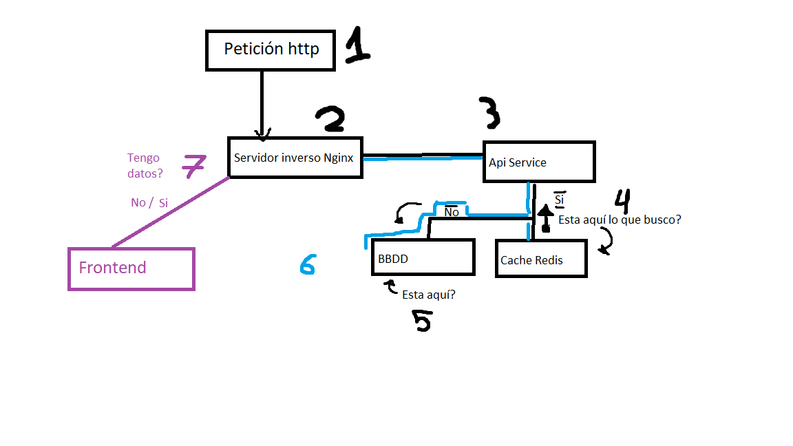

# Arquitectura del sistema

## Servicios del sistema
- proxy (Nginx): punto de entrada, balanceo, rutas.
- frontend (PHP): lógica de la app, vistas.
- db (MariaDB): almacena posts, comentarios, etc.
- redis: caché para acelerar lecturas.
- phpmyadmin: panel web para gestionar la base de datos.

## Comunicación entre servicios
- Cliente → proxy (HTTP)
- Proxy → frontend (HTTP interno)
- Frontend → db (MySQL)
- Frontend → redis (TCP)
- phpMyAdmin → db

## Proxy inverso
- Un solo punto de entrada.
- Oculta servicios internos.
- Permite balanceo y rutas (`/`, `/phpmyadmin`).

## Ventajas de la arquitectura
- Separación de responsabilidades.
- Escalado independiente.
- Mejor mantenimiento y despliegue.

## Diagrama de flujo
1. Petición HTTP llega a Nginx.
2. Nginx reenvía al frontend.
3. Frontend consulta Redis.
4. Si hay caché → responde.
5. Si no hay caché → consulta DB, guarda en Redis y responde.

### 🔹 Parte 1: Comprensión del Proyecto

#### Tarea 1.1: Análisis de la arquitectura

1. Estudia el diagrama de arquitectura proporcionado.

2. Responde en tu documentación:
   
    - ¿Cuántos servicios componen el sistema?
    
    *  Nginx Proxy 
    *  Blog Frontend
    *  phpMyAdmin
    *  API Service 
    *  MySQL/MariaDB 
    *  Redis
    
    - ¿Qué función cumple cada servicio?
    
    * Nginx Proxy conecta el nabegador del usuario correctamente con nuestro frontend y hace que la base de datos y las apis se integren correctamente.
    * Blog Frontend es la parte que ve el usuario, con ella el usuario puede interaccionar con nuestro blog.
    * phpMyAdmin es la parte del backend donde se maneja la información que el usuario no ve y conecta con la base de datos.
    * API Service hace de puente entre diferentes servicios, para hacer que los datos viajen más rapido si los datos estan en la cache accede hay más rápido.
    * MySQL/MariaDB es la base de datos donde se almacenan todos los datos de nuestrá aplicación.
    * Redis son las cookies datos temporales para que la información se almacene sin perderse.

    - ¿Cómo se comunican los servicios entre sí?
    
    * A traves de la red que creamos microblog-net
    
    - ¿Por qué usar un proxy inverso?
    
    * Para gestionar las peticiones independientemente.
    * Ordenar el trafico .
    * Tener más seguridad.
    
    - ¿Qué ventajas tiene esta arquitectura?
    
    * Muy flexible.
    * Prmite cambios o actualizaciones sin tocar al todo el conjunto.
    * Mejora el rendimiento.

3. Dibuja tu propio diagrama de flujo mostrando:
   
    - Cómo una petición HTTP llega al sistema
    - Qué servicios involucra
    - Cómo se accede a los datos
    - Cómo funciona el sistema de caché

    

    * 1. Llega la petición http al servidor inverso.
    * 2. El servidor manda a la Api Service la petición para que la gestione.
    * 3. Api service consulta en la cache si están los datos hay.
    * 4. En caso de que la información no esta en la cache la contulta en la bbdd.
    * 5. Se comprueba si los datos están en la bbdd.
    * 6. Independientemente si se haya encontrado la iformación o no en la cache o la bbdd. Regresamos con la respuesta hasta el sevidor inverso.
    * 7. En caso de tenerlos o no, mostramos un mensaje con el resultado en el frontend.

#### Tarea 1.2: Análisis del código

1. Lee detenidamente todo el código PHP proporcionado.

2. Identifica y documenta:
   
    **En index.php:**
    - ¿Cómo se conecta a la base de datos?
    * Se conecta directamente a MariaDB.
    - ¿Cómo funciona el sistema de caché con Redis?
    * La API intenta obtener los posts desde Redis usando la clave blog:posts:all.

        1. Si Redis tiene los datos los devuelve directamente.

        2. Si Redis no los tiene:

        3. Se hace la consulta SQL a la base de datos.

        Se guardan los resultados en Redis durante 5 minutos:
    
    - ¿Qué pasa si Redis no está disponible?
    * Si Redis falla, el código devuelve un objeto falso que imita a Redis
    - ¿Cómo se obtienen las estadísticas?
    * Se obtienen directamente de la base de datos.
   
    **En database.php y redis.php:**
    - ¿Cómo se leen las variables de entorno?
        * Se usa "$variable= getenv('NOMBRE_VARIABLE')"para guardarla en una variable.
    - ¿Qué valores por defecto se usan?
    * En mariaDB:
        - DB_HOST	db
        - DB_NAME	blogdb
        - DB_USER	bloguser
        - DB_PASS	blogpass
    * En redis:
        - REDIS_HOST	redis
        - REDIS_PORT	6379
    - ¿Cómo se maneja el error de conexión?
    * En database :
    ```php
    catch (PDOException $e) {
    
    die("Error de conexión: " . $e->getMessage());
    
    }
    ```
    *   - La aplicación se detiene y muestra un mensaje de error.

    * redis:
    ```php
    catch (Exception $e) {
    return new class {
        public function get($key) { return false; }
        public function setex(...) { return false; }
        public function exists(...) { return false; }
        public function ping() { return false; }
    };
    }
    ```
    *   - Si falla no se detiene, devuelve un redis falso que no guarda nada.

    **En init.sql:**
    - ¿Qué relaciones hay entre las tablas?
        * Tenemos estas tablas users, posts y comments.

        - user y post:
            * Cada post pertenece a un usuario.
            * Un usuario puede tener muchos post.(1:N)
            * si borras un usuario se borran sus post automáticamente.
        - user y comments:
            * Cada comentario pertenece a un usuario.
            * Un usuario puede escibir muchos comentarios.(1:N)
            * Si borras un usuario tambien sus comentarios.
        - post y comments:
            * Un post puede tener muchos comentarios(1:N)
            * Si borras un post, se borran sus comentarios.

    - ¿Qué índices se crean y por qué?
    * En users:
        - INDEX idx_username (username) para acelerar busquedas por nombre de usurio (login,perfiles...)
    * En post:
        - INDEX idx_created (created_at) para ordenar post por fecha rápidamente.
        - INDEX idx_user (user_id) para listar post de un usuario concreto.
    * En comments:
        - INDEX idx_post (post_id) para cargar comentarios de un post rápido.
        - INDEX idx_created (created_at) para ordenar comentarios por fecha.

    - ¿Cuántos datos de ejemplo se insertan?
    * En usuario se inertan 4.
    * En post se insertan 8.
    * Y por ultimo en commets se insertan 10.

---

#### Tarea 8.2: Respuestas a preguntas de reflexión

Responde detalladamente:

1. **Sobre la arquitectura:**
   
    - ¿Por qué elegiste esta arquitectura?
        *  Está arquitectura está basada en servicios separados, lo elegi por que encaja muy bien con el enfoque de mircroservicios, cada componente tiene su función clara y se ejecuta en su propio contenedor lo que facilita mantener el sistema.
    - ¿Qué beneficios tiene sobre una arquitectura monolítica?
        * Frente a un monolito, esta arquitectura permite:

            - Separar responsabilidades por servicio (web, lógica, datos, caché).

            - Actualizar o reiniciar un servicio sin afectar a los demás.

            - Escalar solo la parte que lo necesita.

            - Tener una configuración más cercana a un entorno real de producción.

    - ¿Qué desafíos presenta?
        * Mayor complejidad inicial:
            - Hay que entender redes, puertos, dependencias entre servicios.

            - Necesidad de coordinar bien las conexiones (variables de entorno, nombres de host de Docker).

            - Manejo de fallos entre servicios.

    - ¿Cómo la mejorarías para producción?
        * Añadir HTTPS en Nginx (certificados TLS).

        * Usar un sistema de logs centralizado (por ejemplo, con una stack tipo ELK).

        * Añadir un sistema de orquestación más avanzado (Kubernetes o Swarm) si se requiere más escala.

2. **Sobre Docker:**
   
    - ¿Qué ventajas ofrece Docker para este proyecto?
    
    * Docker permite levantar toda la arquitectura con un solo comando, garantizando que todos los servicios se ejecuten de forma consistente en cualquier máquina. Evita el clásico “en mi ordenador funciona” y facilita mucho las pruebas, el despliegue y la reproducción del entorno.

    - ¿Qué aprendiste sobre construcción de imágenes?
    * Usar imágenes base oficiales (por ejemplo, PHP, MariaDB, Redis, Nginx).

    * Configurar servicios mediante Dockerfile y docker-compose.yml.

    * Entender la diferencia entre construir una imagen personalizada y usar una ya existente.

    * Optimizar un poco la imagen evitando cosas innecesarias y usando volúmenes para datos.

    - ¿Qué dificultades encontraste?
    * Encontre varios fallos producidos por rutas erroneas.
    - ¿Cómo las resolviste?
    * Pero se resolvieron facil a establecerlas y reiniciar todo.

3. **Sobre persistencia:**
   
    - ¿Cómo garantizas que los datos no se pierdan?
    * Backups periódicos sobre la base de datos.
    - ¿Qué estrategia de backup implementarías?
    * Almacenamiento de esos backups en un lugar externo (otro servidor, almacenamiento en la nube).
    - ¿Cómo migrarías datos entre entornos?
    * Exportaría la base de datos con mysqldump.

4. **Sobre escalabilidad:**
   
    - ¿El sistema puede escalar horizontalmente?
    * Sí, el sistema puede escalar horizontalmente en algunos servicios.
    - ¿Qué servicios son stateless y cuáles stateful?
    
    * Stateless: Nginx, servicio PHP (App Service). No guardan datos propios, solo procesan peticiones.

    * Stateful: MariaDB (base de datos), Redis (caché), y los volúmenes donde se guardan datos persistentes.
    
    - ¿Cómo manejarías mayor carga?

    * Escalaría horizontalmente el servicio PHP y Nginx.
    
    - ¿Qué cuellos de botella identificas?
    * La base de datos, si recibe muchas consultas sin caché.

    * El servicio PHP, si tiene demasiadas peticiones concurrentes.

    * Redis, si se usa intensivamente sin recursos suficientes.

5. **Sobre monitoreo:**
   
    - ¿Cómo sabrías si un servicio falla?
    * Revisando los logs de los contenedores y el estado de los servicios con docker ps.
    - ¿Qué métricas son importantes monitorear?
    
    * Uso de CPU y memoria de cada servicio.

    * Latencia de las peticiones HTTP.

    * Número de errores (5xx) en Nginx/PHP.
    
    - ¿Cómo implementarías alertas?
    - Con un sistema de monitoreo con alertas por correo y detectaría:

    * Umbrales de CPU/memoria.

    * Caída de un servicio (healthchecks fallidos).

    * Tiempo de respuesta demasiado alto.
---

