### 🔹 Parte 2: Construcción de Imágenes Docker

#### Tarea 2.1: Imagen del Frontend

Crea un Dockerfile para el servicio frontend que:

1. Use una imagen base apropiada (php con apache o nginx).
2. Instale las extensiones PHP necesarias:
   
    - `pdo`
    - `pdo_mysql`
    - `redis`

3. Copie el código de la aplicación al directorio correcto.
4. Configure las variables de entorno necesarias.
5. Exponga el puerto apropiado.

**Estructura del proyecto frontend:**
```
frontend/
├── Dockerfile
├── public/
│   └── index.php
└── config/
    ├── database.php
    └── redis.php
```

#### Tarea 2.2: Construcción de la imagen

1. Construye la imagen del frontend:
   
    - Nombre: `tu_usuario/microblog-frontend`
    - Etiqueta: `v1.0`

* docker build -t rando/microblog-frontend:v1.0 .

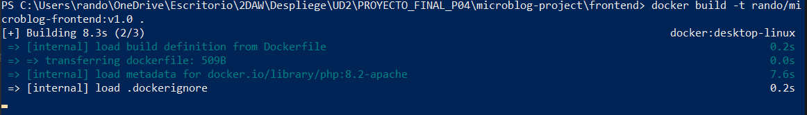

2. Verifica que la imagen se construyó correctamente.
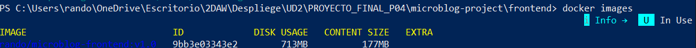
3. Documenta el tamaño de la imagen.
* 177MB


### 🔹 Parte 3: Configuración con Docker Compose

#### Tarea 3.1: Diseño del docker-compose.yml

Crea un archivo `docker-compose.yml` que defina todos los servicios:

**Servicios a definir:**

1. **proxy** (Nginx)
   
    - Imagen oficial de Nginx
    - Puerto 80 del host
    - Montar configuración nginx.conf
    - Depende de frontend y phpmyadmin

2. **frontend**
   
    - Tu imagen construida
    - Variables de entorno para BD y Redis
    - Depende de db y redis

3. **db** (MariaDB)
   
    - Imagen oficial de MariaDB
    - Variables de entorno para configuración
    - Volumen para persistencia de datos
    - Montar script init.sql para inicialización

4. **redis**
   
    - Imagen oficial de Redis
    - (Opcional) Volumen para persistencia

5. **phpmyadmin**
   
    - Imagen oficial de phpMyAdmin
    - Variables de entorno para conectar a db
    - Depende de db

**Redes:**
- Define una red personalizada para todos los servicios

**Volúmenes:**
- Volumen para datos de MySQL
- (Opcional) Volumen para datos de Redis

#### Tarea 3.2: Variables de entorno

Crea un archivo `.env` con todas las configuraciones:

```env
# Base de Datos
MYSQL_ROOT_PASSWORD=rootpassword_seguro
MYSQL_DATABASE=blogdb
MYSQL_USER=bloguser
MYSQL_PASSWORD=blogpass_seguro

# Configuración del Frontend
DB_HOST=db
DB_NAME=blogdb
DB_USER=bloguser
DB_PASS=blogpass_seguro
REDIS_HOST=redis
REDIS_PORT=6379

# phpMyAdmin
PMA_HOST=db
PMA_USER=bloguser
PMA_PASSWORD=blogpass_seguro

# Puertos
PROXY_PORT=80
PHPMYADMIN_PORT=8081
```

---


### 🔹 Parte 4: Despliegue y Pruebas

#### Tarea 4.1: Primer despliegue

1. Asegúrate de tener la estructura completa:

```
microblog-project/
├── docker-compose.yml
├── .env
├── frontend/
│   ├── Dockerfile
│   ├── public/
│   │   └── index.php
│   └── config/
│       ├── database.php
│       └── redis.php
├── database/
│   └── init.sql
└── proxy/
    └── nginx.conf
```

2. Construye todas las imágenes necesarias.

*  docker build -t randon/microblog-frontend:v1.0 ./frontend
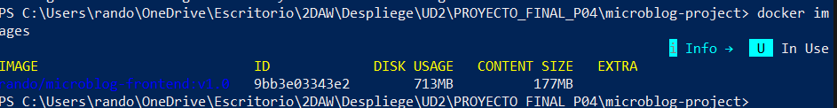
3. Despliega el sistema completo con Docker Compose.

* docker compose up -d
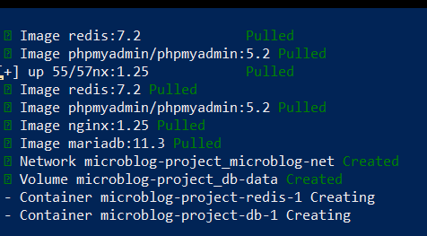
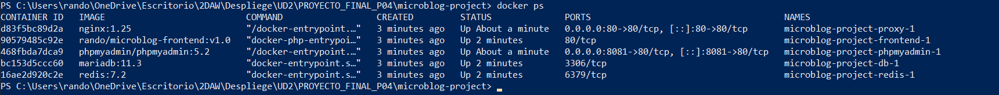

4. Observa los logs de todos los servicios:
   
    - ¿Se inició correctamente cada servicio?
    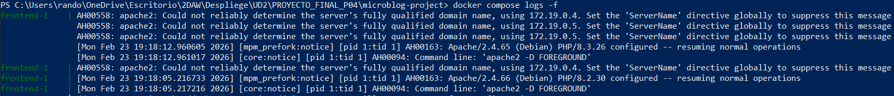
    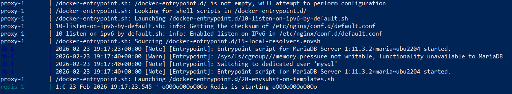
    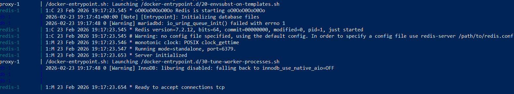
    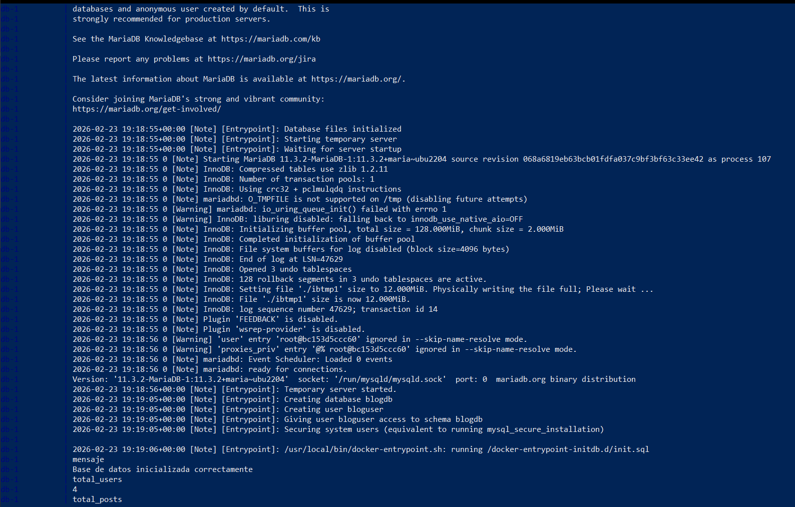
    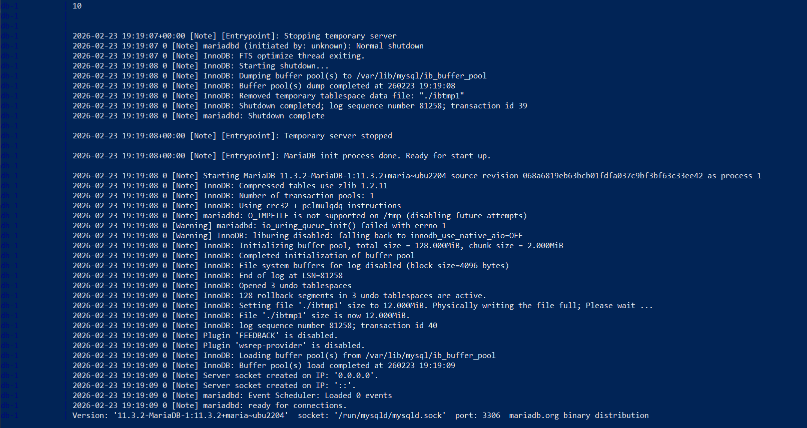
    - ¿Hay errores?
    No
    - ¿La base de datos se inicializó?
    Sí
    

#### Tarea 4.2: Verificación funcional

1. **Acceso al blog:**
   
    - Accede a `http://localhost`
    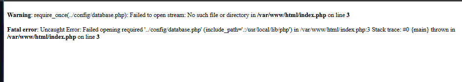
    Oh valla, un momento confusión de rutas.
    ```php
    <?php
    session_start();
    require_once __DIR__ . './config/database.php';
    require_once __DIR__ . './config/redis.php';
    ```
    * Ahora está mejor, DIR apunta siempre al directorio donde está el archivo.
    - Recontruyo la imagen del frontend:
    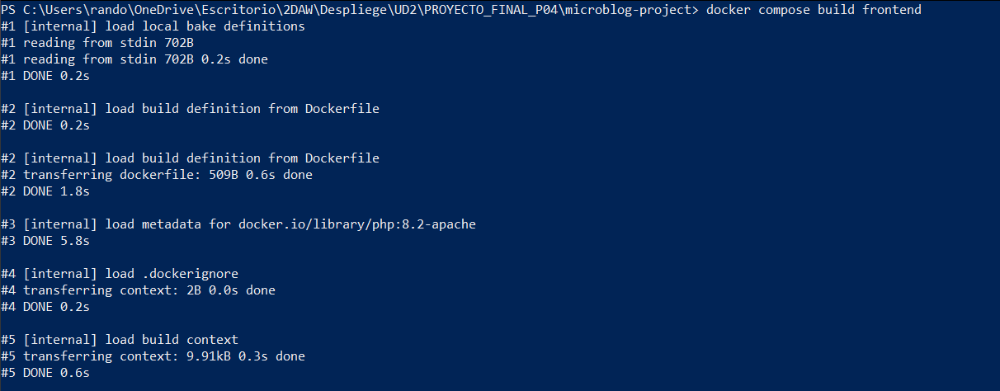
    - Está tardando demasiado por que quiere subirse a docker hub, así que cancelo.
    - El nombre está influyendo en la modificación de la imagen por lo que lo voy a renombrar y a reconstruirla.
    - limpiamos lo que creamos:
    *  docker compose down
    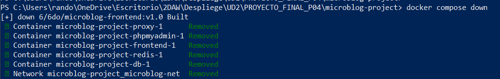
    - La renombramos 
    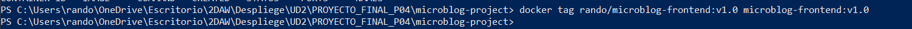
    * Y modificamos el yml para poner el nombre nuevo de la imagen.
    * ahora si la reconstruimos.
    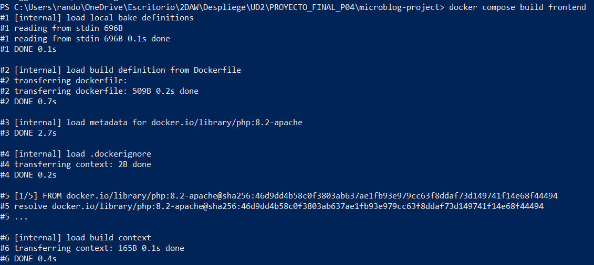
    * verificamos que esté
    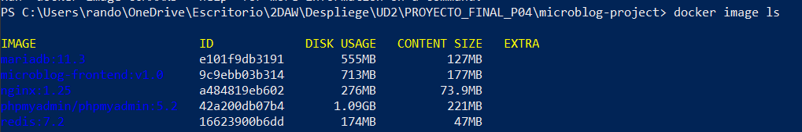
    * y lo volvemos a levantar
    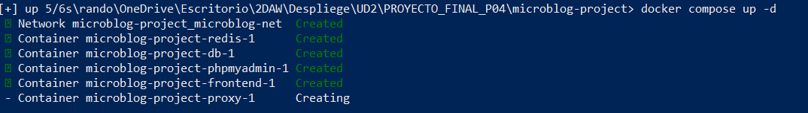
    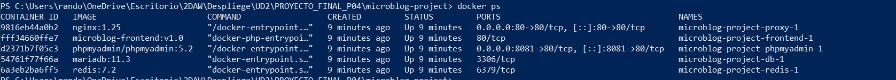
    * Se me escapo un punto en la ruta(tener mucho cuidado)
    ```php
    Warning: require_once(/var/www/html./config/database.php): Failed to open stream: No such file or directory in /var/www/html/index.php on line 3
    
    Fatal error: Uncaught Error: Failed opening required '/var/www/html./config/database.php' (include_path='.:/usr/local/lib/php') in /var/www/html/index.php:3 Stack trace: #0 {main} thrown in /var/www/html/index.php on line 3

    //Con esto ahora si quei si 
    require_once __DIR__ . '/config/database.php';
    require_once __DIR__ . '/config/redis.php';

    ```

    - Verifica que se muestran los posts
    - Verifica que las estadísticas son correctas
        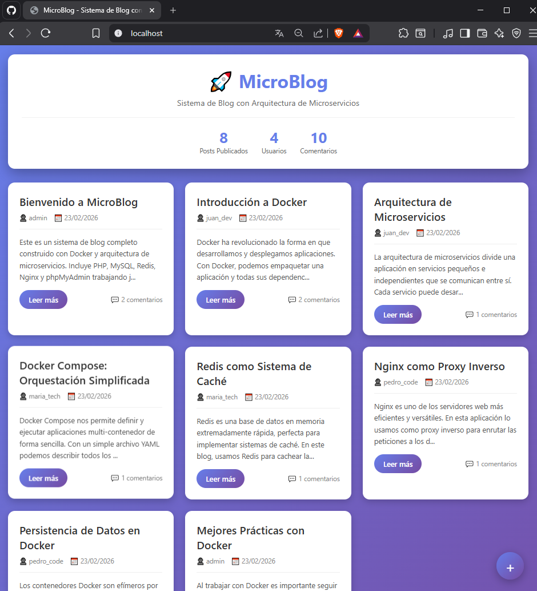
    - Verifica la información del sistema
    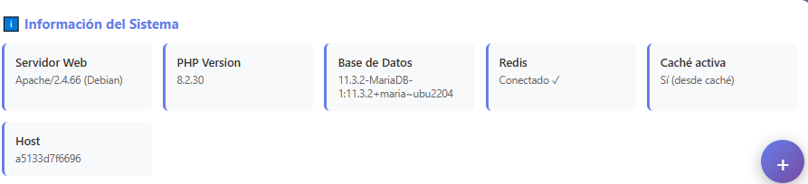


2. **Acceso a phpMyAdmin:**
   
    - Accede a `http://localhost/phpmyadmin`
    - Inicia sesión con las credenciales configuradas
    - Explora las tablas creadas
    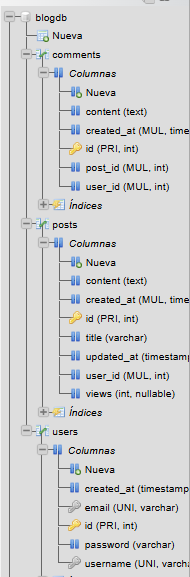
    - Verifica los datos insertados
    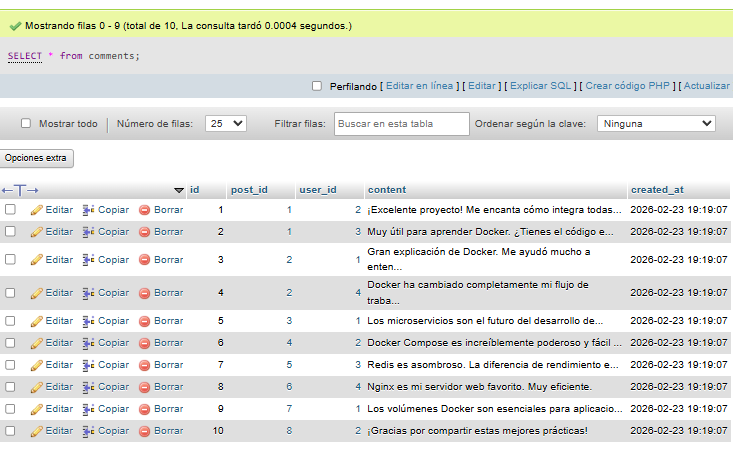
    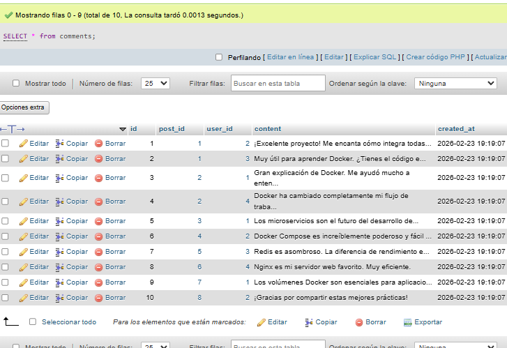
    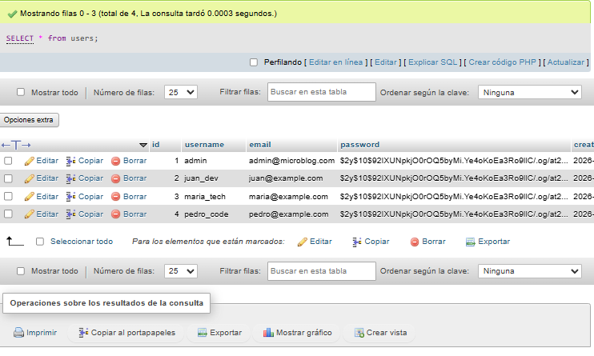

3. **Verificación de caché:**
   
    - Primera carga: datos desde BD
    - Segunda carga: datos desde caché
    - Observa la diferencia en "Información del Sistema"
    * Borré la cache con "docker exec -it microblog-project-redis-1 redis-cli FLUSHALL"
    * Sin embargo  los datos no cambian.
    * 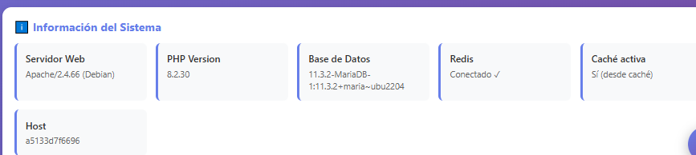

4. **Logs y monitoreo:**
   
    - Revisa los logs de Nginx
    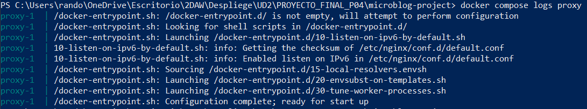
    - Revisa los logs del frontend
    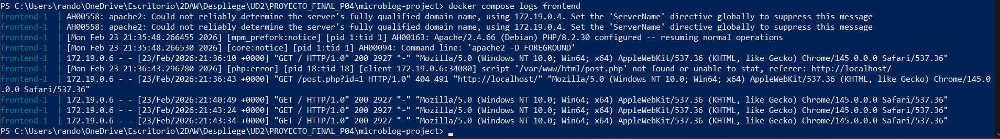
    - Revisa los logs de MySQL
    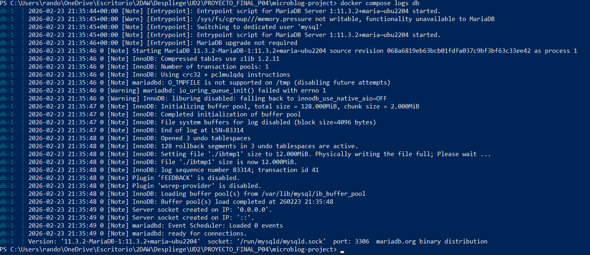

#### Tarea 4.3: Pruebas de persistencia

1. Desde phpMyAdmin, inserta un nuevo post manualmente.
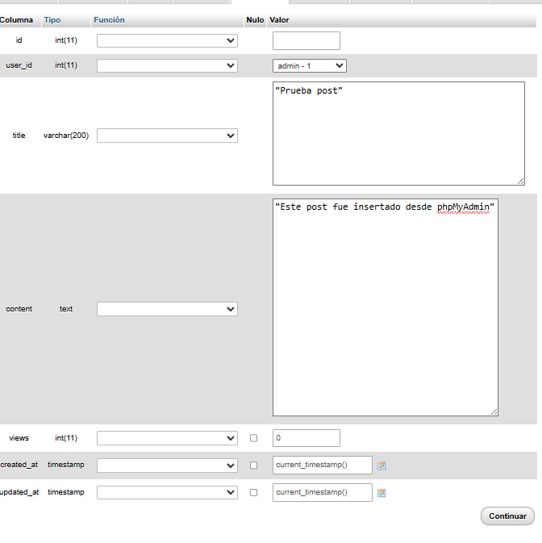
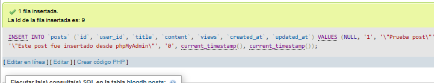
2. Recarga la página del blog y verifica que aparece.
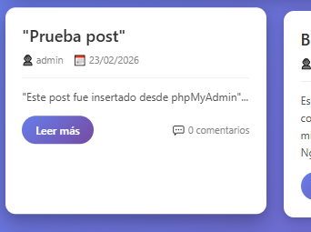
3. Detén todos los contenedores.
* docker compose down
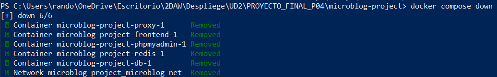
4. Vuelve a iniciarlos.
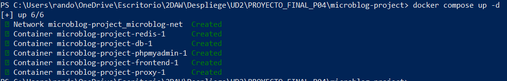
5. Verifica que:
   
    - Todos los posts siguen ahí
    - Los datos persisten
    - El sistema funciona correctamente
    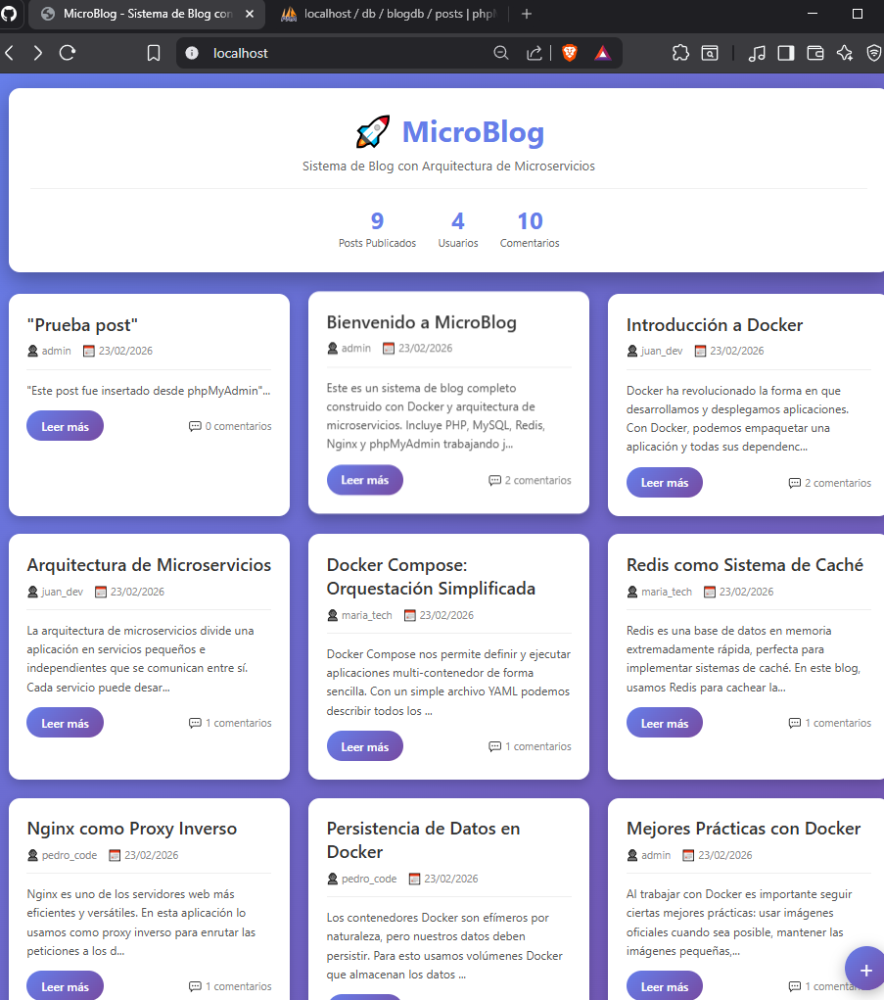


---

### 🔹 Parte 5: Funcionalidades Adicionales (Ampliación)

#### Tarea 5.1: Página de detalle de post

Crea un nuevo archivo `frontend/public/post.php` que:
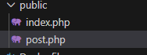
1. Muestre el contenido completo de un post.
2. Muestre todos sus comentarios.
3. Incremente el contador de vistas.
4. Use caché de Redis para el post.

#### Tarea 5.2: API REST

Crea un servicio API separado:

1. Nuevo servicio en docker-compose.yml.
2. Endpoints REST:
   
    - `GET /api/posts` - Listar posts
    - `GET /api/posts/:id` - Obtener post
    - `POST /api/posts` - Crear post
    - `GET /api/stats` - Estadísticas del sistema
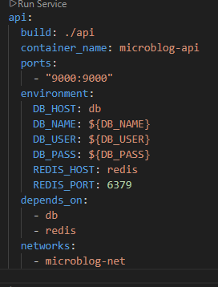

3. Documentación de la API.
- GET /api/posts
- Devuelve una lista de posts.

- Respuesta:

```json
    [
    { "id": 1, "title": "Hola", "author": "admin", "created_at":  "2026-02-23" }
    ]
    GET /api/posts/:id
```
- Devuelve un post completo.
- Usa Redis como caché.

- POST /api/posts
- Crea un nuevo post.

- Body JSON:

```json
{
  "title": "Nuevo post",
  "content": "Contenido",
  "author": "admin"
}
```
- GET /api/stats
- Devuelve estadísticas del sistema:

```json
{
  "posts": 8,
  "comments": 10,
  "users": 4,
  "redis_connected": true
}
```

#### Tarea 5.3: Monitoreo

Añade un servicio de monitoreo:

1. **Opción 1:** Añadir un contenedor con Grafana + Prometheus
2. **Opción 2:** Crear un dashboard simple en PHP
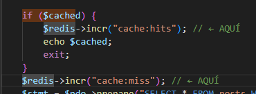
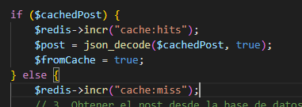
---
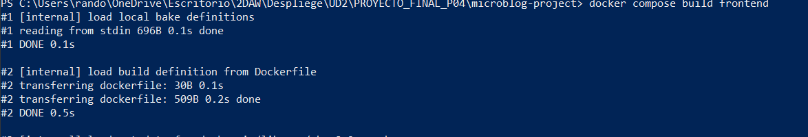
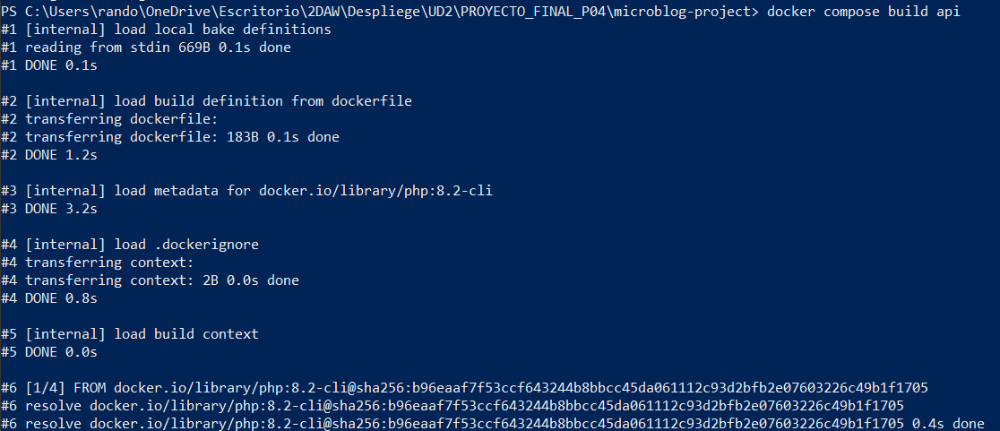
- Me ocurrio otro que mi api no tenia instalada la extension de redis para php. Así que añadi la extensión antes del copy en mi dokerfile de la api.
- Y a volver a reconstruir, bajar y levantar todo otra vez.(tambien me confundi con el nomrbre del archivo)
