# Práctica 2.3 - Construcción de imagen Docker con PHP y base de datos

## Descripción

**Actividad:** Construcción de imagen Docker personalizada para una aplicación PHP que se conecta a una base de datos MariaDB.

En esta práctica crearás una imagen Docker personalizada para una aplicación PHP que se conecta a una base de datos MariaDB. Aprenderás a construir imágenes configurables mediante variables de entorno y a inicializar bases de datos automáticamente.

---

## Objetivo general

Aprender a:

- Construir imágenes configurables con variables de entorno
- Conectar aplicaciones PHP con bases de datos
- Instalar extensiones PHP para acceso a bases de datos
- Crear scripts de inicialización para contenedores
- Gestionar dependencias entre contenedores
- Inicializar bases de datos automáticamente

---

## Contexto de trabajo

Las aplicaciones web modernas normalmente necesitan acceder a bases de datos. En Docker, esto implica:

- **Imagen de aplicación:** Contiene el código PHP y las extensiones necesarias
- **Imagen de base de datos:** Contenedor separado con MariaDB/MySQL
- **Variables de entorno:** Para configurar la conexión de forma flexible
- **Script de inicialización:** Para preparar la base de datos al iniciar

### Arquitectura de la aplicación

```
┌─────────────────────┐          ┌──────────────────────┐
│   Contenedor PHP    │─────────▶│  Contenedor MariaDB  │
│  (Tu imagen)        │          │  (Imagen oficial)    │
│                     │          │                      │
│  - Apache + PHP     │          │  - Base de datos     │
│  - App PHP          │          │  - Puerto 3306       │
│  - Script init      │          │  - Volumen datos     │
│  - Puerto 80        │          │                      │
└─────────────────────┘          └──────────────────────┘
```

---

## 📦 Archivos de la aplicación

Se te proporcionan todos los archivos necesarios. Créalos en un directorio `build/`:

### Archivo `build/app/index.php`

```php
<!DOCTYPE html>
<html lang="es">
<head>
    <meta charset="UTF-8">
    <meta name="viewport" content="width=device-width, initial-scale=1.0">
    <title>Gestión de Usuarios - Docker</title>
    <style>
        * {
            margin: 0;
            padding: 0;
            box-sizing: border-box;
        }
        body {
            font-family: 'Segoe UI', Tahoma, Geneva, Verdana, sans-serif;
            background: linear-gradient(135deg, #667eea 0%, #764ba2 100%);
            min-height: 100vh;
            padding: 20px;
        }
        .container {
            max-width: 900px;
            margin: 0 auto;
            background: white;
            border-radius: 15px;
            box-shadow: 0 20px 60px rgba(0,0,0,0.3);
            overflow: hidden;
        }
        .header {
            background: linear-gradient(135deg, #667eea 0%, #764ba2 100%);
            color: white;
            padding: 30px;
            text-align: center;
        }
        .header h1 {
            font-size: 2.5em;
            margin-bottom: 10px;
        }
        .content {
            padding: 30px;
        }
        .info-box {
            background: #f8f9fa;
            border-left: 4px solid #667eea;
            padding: 15px;
            margin: 20px 0;
            border-radius: 5px;
        }
        .success {
            background: #d4edda;
            border-left-color: #28a745;
            color: #155724;
        }
        .error {
            background: #f8d7da;
            border-left-color: #dc3545;
            color: #721c24;
        }
        table {
            width: 100%;
            border-collapse: collapse;
            margin: 20px 0;
            box-shadow: 0 2px 10px rgba(0,0,0,0.1);
        }
        thead {
            background: #667eea;
            color: white;
        }
        th, td {
            padding: 15px;
            text-align: left;
            border-bottom: 1px solid #ddd;
        }
        tbody tr:hover {
            background: #f5f5f5;
        }
        tbody tr:nth-child(even) {
            background: #f9f9f9;
        }
        .db-info {
            display: grid;
            grid-template-columns: repeat(auto-fit, minmax(200px, 1fr));
            gap: 15px;
            margin: 20px 0;
        }
        .db-card {
            background: #e3f2fd;
            padding: 15px;
            border-radius: 8px;
            border-left: 3px solid #2196F3;
        }
        .db-card strong {
            display: block;
            color: #1976D2;
            margin-bottom: 5px;
            font-size: 0.9em;
        }
        .db-card span {
            font-size: 1.1em;
            font-weight: 600;
            color: #333;
        }
    </style>
</head>
<body>
    <div class="container">
        <div class="header">
            <h1>🗄️ Gestión de Usuarios</h1>
            <p>Aplicación PHP + MariaDB en Docker</p>
        </div>
        
        <div class="content">
            <h2>Información de Conexión</h2>
            <div class="db-info">
                <div class="db-card">
                    <strong>Host de Base de Datos:</strong>
                    <span><?php echo getenv('DB_HOST') ?: 'No configurado'; ?></span>
                </div>
                <div class="db-card">
                    <strong>Base de Datos:</strong>
                    <span><?php echo getenv('DB_NAME') ?: 'No configurado'; ?></span>
                </div>
                <div class="db-card">
                    <strong>Usuario:</strong>
                    <span><?php echo getenv('DB_USER') ?: 'No configurado'; ?></span>
                </div>
            </div>

            <?php
            // Leer credenciales desde variables de entorno
            $host = getenv('DB_HOST');
            $user = getenv('DB_USER');
            $pass = getenv('DB_PASS');
            $db = getenv('DB_NAME');

            // Intentar conectar a la base de datos
            $conn = new mysqli($host, $user, $pass, $db);

            if ($conn->connect_error) {
                echo '<div class="info-box error">';
                echo '<h3>❌ Error de Conexión</h3>';
                echo '<p><strong>Error:</strong> ' . htmlspecialchars($conn->connect_error) . '</p>';
                echo '<p><strong>Código:</strong> ' . $conn->connect_errno . '</p>';
                echo '</div>';
            } else {
                echo '<div class="info-box success">';
                echo '<h3>✅ Conexión Exitosa</h3>';
                echo '<p>Conectado correctamente a la base de datos MariaDB</p>';
                echo '</div>';

                // Consultar usuarios
                $sql = 'SELECT * FROM users';
                $users = [];

                if ($result = $conn->query($sql)) {
                    while ($data = $result->fetch_object()) {
                        $users[] = $data;
                    }
                    $result->free();
                }

                if (count($users) > 0) {
                    echo '<h2>Lista de Usuarios</h2>';
                    echo '<table>';
                    echo '<thead><tr><th>ID</th><th>Usuario</th><th>Email</th><th>Fecha Registro</th></tr></thead>';
                    echo '<tbody>';
                    foreach ($users as $user) {
                        echo '<tr>';
                        echo '<td>' . htmlspecialchars($user->id) . '</td>';
                        echo '<td>' . htmlspecialchars($user->username) . '</td>';
                        echo '<td>' . htmlspecialchars($user->email) . '</td>';
                        echo '<td>' . htmlspecialchars($user->created_at ?? 'N/A') . '</td>';
                        echo '</tr>';
                    }
                    echo '</tbody>';
                    echo '</table>';
                    echo '<div class="info-box">';
                    echo '<p><strong>Total de usuarios:</strong> ' . count($users) . '</p>';
                    echo '</div>';
                } else {
                    echo '<div class="info-box">';
                    echo '<p>⚠️ No hay usuarios registrados en la base de datos.</p>';
                    echo '</div>';
                }

                mysqli_close($conn);
            }
            ?>

            <div class="info-box" style="margin-top: 30px; background: #fff3cd; border-left-color: #ffc107;">
                <h3>ℹ️ Información Técnica</h3>
                <p><strong>PHP Version:</strong> <?php echo phpversion(); ?></p>
                <p><strong>Extensión MySQLi:</strong> <?php echo extension_loaded('mysqli') ? '✓ Cargada' : '✗ No cargada'; ?></p>
                <p><strong>Servidor:</strong> <?php echo $_SERVER['SERVER_SOFTWARE']; ?></p>
            </div>
        </div>
    </div>
</body>
</html>
```

### Archivo `build/schema.sql`

```sql
-- Crear tabla de usuarios
CREATE TABLE IF NOT EXISTS users (
    id INT AUTO_INCREMENT PRIMARY KEY,
    username VARCHAR(50) NOT NULL UNIQUE,
    email VARCHAR(100) NOT NULL,
    password VARCHAR(255) NOT NULL,
    created_at TIMESTAMP DEFAULT CURRENT_TIMESTAMP
) ENGINE=InnoDB DEFAULT CHARSET=utf8mb4;

-- Insertar usuarios de ejemplo
INSERT INTO users (username, email, password) VALUES
('admin', 'admin@example.com', 'admin123'),
('maria_garcia', 'maria@example.com', 'pass456'),
('juan_lopez', 'juan@example.com', 'pass789'),
('ana_martinez', 'ana@example.com', 'pass321'),
('carlos_rodriguez', 'carlos@example.com', 'pass654');

-- Mensaje de confirmación
SELECT 'Base de datos inicializada correctamente' AS mensaje;
```

### Archivo `build/script.sh`

```bash
#!/bin/bash

echo "====================================="
echo "Iniciando script de configuración..."
echo "====================================="

# Mostrar variables de entorno (sin contraseñas)
echo "Host de BD: ${DB_HOST}"
echo "Usuario de BD: ${DB_USER}"
echo "Nombre de BD: ${DB_NAME}"
echo ""

# Esperar a que MariaDB esté disponible
echo "Esperando a que MariaDB esté disponible..."
COUNTER=0
MAX_TRIES=30

while ! mysql -u "${DB_USER}" -p"${DB_PASS}" -h "${DB_HOST}" -e ";" 2>/dev/null; do
    COUNTER=$((COUNTER + 1))
    if [ $COUNTER -gt $MAX_TRIES ]; then
        echo "ERROR: No se pudo conectar a MariaDB después de $MAX_TRIES intentos"
        exit 1
    fi
    echo "Intento $COUNTER/$MAX_TRIES - MariaDB no está lista aún, esperando..."
    sleep 2
done

echo "✓ MariaDB está disponible!"
echo ""

# Inicializar la base de datos
echo "Inicializando base de datos..."
if mysql -u "${DB_USER}" -p"${DB_PASS}" -h "${DB_HOST}" "${DB_NAME}" < /opt/schema.sql; then
    echo "✓ Base de datos inicializada correctamente"
else
    echo "ERROR: Fallo al inicializar la base de datos"
    exit 1
fi

echo ""
echo "====================================="
echo "Iniciando servidor Apache..."
echo "====================================="

# Iniciar Apache en primer plano
apache2ctl -D FOREGROUND
```

---

## 🔹 Parte 1: Comprensión de la arquitectura

### Tarea 1.1: Análisis de los archivos proporcionados

Lee detenidamente cada archivo proporcionado.

#### Responde en tu documentación:

**Sobre `index.php`:**

1. **¿Cómo obtiene las credenciales de la base de datos?**
   
   > [Obtiene las credenciales desde variables de entorno usando la función getenv(). Por ejemplo: getenv('DB_HOST'), getenv('DB_USER'), getenv('DB_PASS') y getenv('DB_NAME').]

2. **¿Por qué es mejor usar variables de entorno que hardcodear las credenciales?**
   
   > [Porque permite configurar la aplicación sin modificar el código, facilita el despliegue en diferentes entornos y mejora la seguridad al no exponer directamente las contraseñas en el código fuente.]

3. **¿Qué extensión PHP usa para conectarse a MariaDB?**
   
   > [La extensión mysqli.]

**Sobre `schema.sql`:**

1. **¿Qué estructura tiene la tabla `users`?**
   
   > [La tabla users tiene los campos:

id INT AUTO_INCREMENT PRIMARY KEY

username VARCHAR(50) NOT NULL UNIQUE

email VARCHAR(100) NOT NULL

password VARCHAR(255) NOT NULL

created_at TIMESTAMP DEFAULT CURRENT_TIMESTAMP]

2. **¿Cuántos usuarios de ejemplo se insertan?**
   
   > [Se insertan 5 usuarios de ejemplo: 'admin', 'maria_garcia', 'juan_lopez', 'ana_martinez' y 'carlos_rodriguez'.]

3. **¿Por qué es útil tener un archivo SQL separado?**
   
   > [Permite inicializar la base de datos de forma consistente, facilita la reutilización y el versionado de la estructura y datos iniciales sin modificar la aplicación.]

**Sobre `script.sh`:**

1. **¿Qué hace el bucle `while`?**
   
   > [Comprueba repetidamente si MariaDB está disponible intentando conectarse con mysql -u "$DB_USER" -p"$DB_PASS" -h "$DB_HOST".
Si no puede conectarse, espera 2 segundos y vuelve a intentar hasta un máximo de 30 intentos.]

2. **¿Por qué es necesario esperar a que MariaDB esté disponible?**
   
   > [Porque el contenedor de la aplicación podría iniciarse antes que MariaDB, y si se intenta inicializar la base de datos o conectarse antes de tiempo, fallará.]

3. **¿Qué comando inicia Apache?**
   
   > [El comando es: apache2ctl -D FOREGROUND.]

4. **¿Por qué `-D FOREGROUND`?**
   
   > [Para que Apache se ejecute en primer plano dentro del contenedor, lo que es necesario para que Docker mantenga activo el contenedor. Si se ejecutara en segundo plano, Docker terminaría el contenedor inmediatamente.]

---

### Tarea 1.2: Estructura del proyecto

Crea la estructura de directorios:

```
proyecto_php_bd/
├── build/
│   ├── Dockerfile
│   ├── script.sh
│   ├── schema.sql
│   └── app/
│       └── index.php
└── docker-compose.yml
```

**Captura de pantalla de la estructura de directorios:**

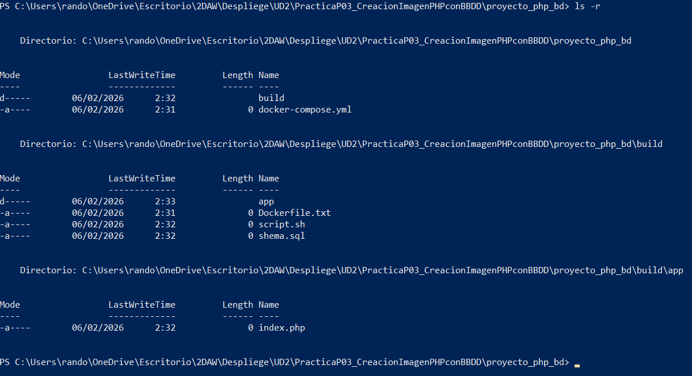

**Verificación de permisos de `script.sh`:**

```bash
ls -la build/script.sh
```
(para los permisos uso la consola de git)
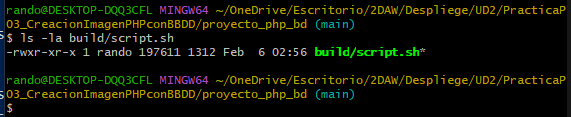
---

## 🔹 Parte 2: Creación del Dockerfile

### Tarea 2.1: Diseño del Dockerfile

Tu Dockerfile debe realizar las siguientes tareas:

**1. Imagen base:**
- Partir de `php:7.4-apache` o `php:8.2-apache`

**2. Instalación de dependencias:**
- Instalar el cliente de MariaDB (`mariadb-client`)
- Instalar la extensión PHP `mysqli`
- Habilitar la extensión `mysqli`

**3. Copia de archivos:**
- Copiar `app/` al DocumentRoot de Apache
- Copiar `script.sh` a `/usr/local/bin/`
- Copiar `schema.sql` a `/opt/`

**4. Variables de entorno:**
- Definir `DB_USER` con valor por defecto
- Definir `DB_PASS` con valor por defecto
- Definir `DB_NAME` con valor por defecto
- Definir `DB_HOST` con valor por defecto

**5. Permisos y configuración:**
- Dar permisos de ejecución a `script.sh`
- Exponer el puerto 80

**6. Comando de inicio:**
- Establecer que al iniciar el contenedor se ejecute `script.sh`

#### Dockerfile creado:

```dockerfile
# 1. Imagen base con PHP y Apache
FROM php:8.2-apache

# 2. Actualizar sistema e instalar mariadb-client
RUN apt-get update && apt-get install -y \
    mariadb-client \
    && rm -rf /var/lib/apt/lists/*

# 3. Instalar y habilitar la extensión mysqli
RUN docker-php-ext-install mysqli \
    && docker-php-ext-enable mysqli

# 4. Copiar archivos de la aplicación al DocumentRoot de Apache
COPY app/ /var/www/html/

# 5. Copiar script de inicialización y schema SQL
COPY script.sh /usr/local/bin/
COPY schema.sql /opt/

# 6. Dar permisos de ejecución al script
RUN chmod +x /usr/local/bin/script.sh

# 7. Definir variables de entorno con valores por defecto
ENV DB_HOST=db \
    DB_USER=usuario_app \
    DB_PASS=password_app \
    DB_NAME=aplicacion_db

# 8. Exponer puerto 80 (HTTP)
EXPOSE 80

# 9. Ejecutar script de inicialización al iniciar contenedor
CMD ["script.sh"]
```

**Captura del Dockerfile:**

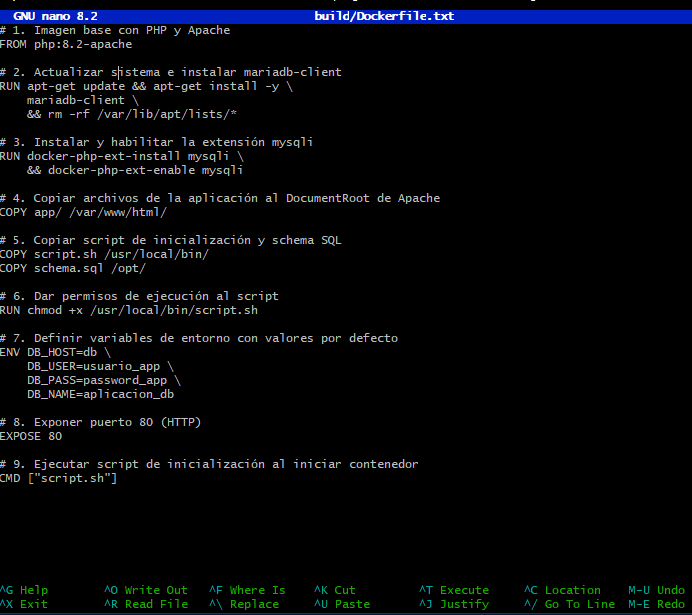

---

### Tarea 2.2: Construcción de la imagen

**Comando de construcción:**

```bash
docker build -t rando/app_php_bd:v1 build/
```
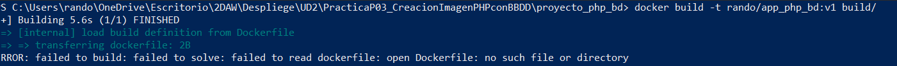
(Error tonto simplemente puse el dockerfile como txt voya arreglarlo)
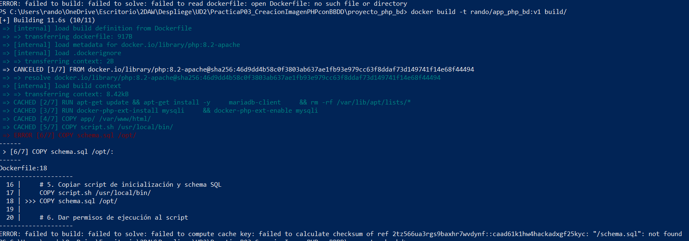
(Hay que comprobar bien los nombres para que los pueda reconoces cuidado)
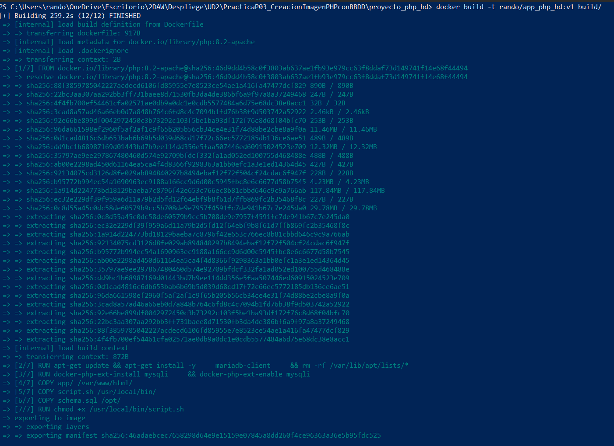
(ahora si)

**Captura del proceso de build:**

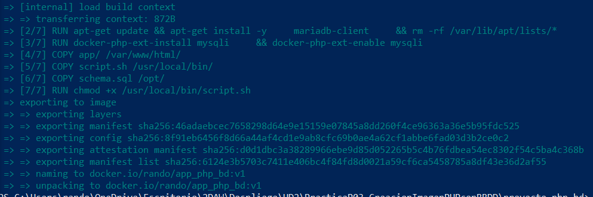

**Verificación de la imagen creada:**

```bash
docker images
```

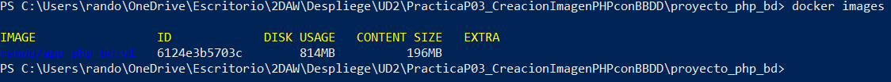

**Tamaño de la imagen:** `[196MB]`

---

## 🔹 Parte 3: Despliegue con Docker Compose

### Tarea 3.1: Creación del `docker-compose.yml`

Crea un archivo `docker-compose.yml` que defina:

**Servicio de aplicación PHP (`app`):**
- Tu imagen personalizada
- Puerto 8080 del host → puerto 80 del contenedor
- Variables de entorno para conexión a BD
- Dependencia del servicio de base de datos
- Política de reinicio

**Servicio de base de datos (`db`):**
- Imagen `mariadb`
- Variables de entorno para crear la BD
- Volumen Docker para persistir los datos
- Política de reinicio

**Volumen:**
- Define un volumen Docker para los datos de MariaDB

#### docker-compose.yml creado:

```yaml
version: '3.8'

services:
  # Servicio de la aplicación PHP
  app:
    image: tu_usuario/app_php_bd:v1  # ⚠️ CAMBIA "tu_usuario"
    container_name: php_app
    ports:
      - "8080:80"  # Puerto 8080 del host → puerto 80 del contenedor
    environment:
      # Variables para conectar a la base de datos
      DB_HOST: db
      DB_USER: usuario_app
      DB_PASS: password_app
      DB_NAME: aplicacion_db
    depends_on:
      - db  # Asegura que db se inicie antes que app
    restart: unless-stopped
    networks:
      - red_app

  # Servicio de base de datos MariaDB
  db:
    image: mariadb:latest
    container_name: mariadb_db
    environment:
      # Variables para inicializar MariaDB
      MYSQL_ROOT_PASSWORD: root_password_seguro
      MYSQL_DATABASE: aplicacion_db
      MYSQL_USER: usuario_app
      MYSQL_PASSWORD: password_app
    volumes:
      - datos_mariadb:/var/lib/mysql  # Persistencia de datos
    restart: unless-stopped
    networks:
      - red_app

# Definición de volúmenes
volumes:
  datos_mariadb:  # Volumen Docker para datos persistentes

# Definición de redes
networks:
  red_app:  # Red personalizada para comunicación entre contenedores
```

**Captura del docker-compose.yml:**

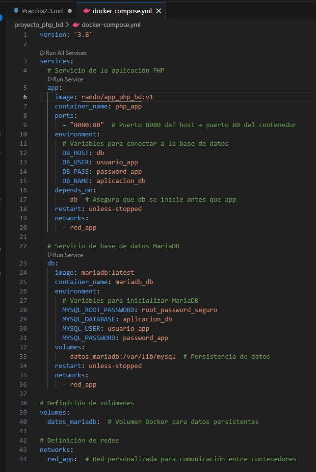

---

### Tarea 3.2: Despliegue y pruebas

**Comando de despliegue:**

```bash
docker-compose up -d
```

**Captura del despliegue:**

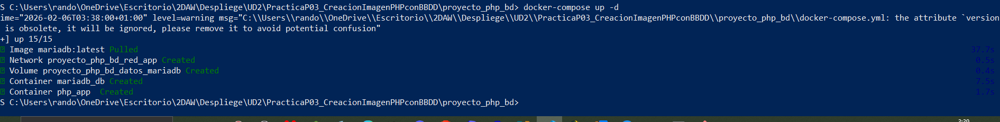

**Observación de logs del contenedor app:**

```bash
docker-compose logs app
```

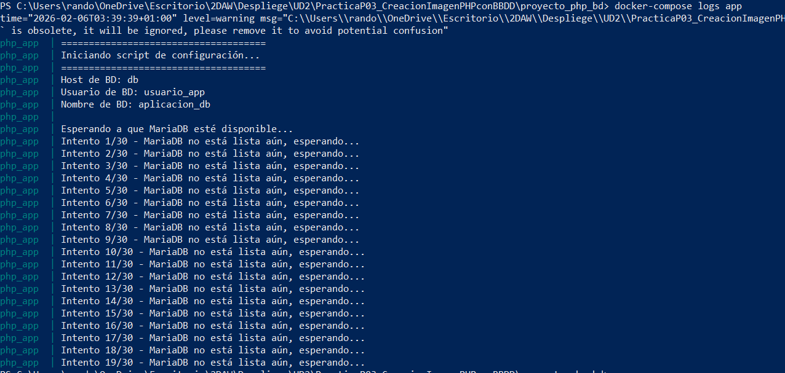

**Observación de logs del contenedor db:**

```bash
docker-compose logs db
```

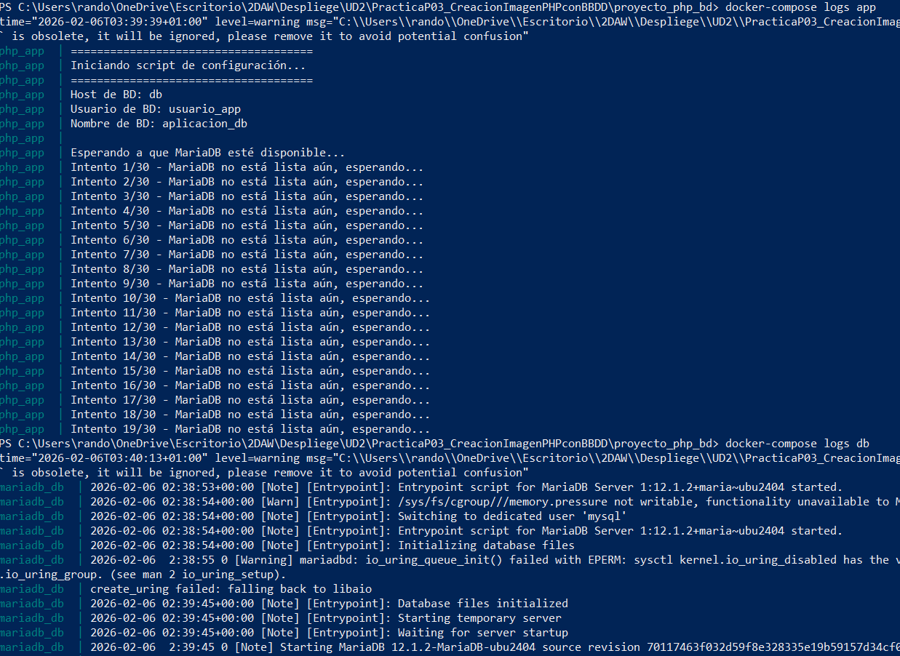

#### Preguntas sobre los logs:

1. **¿Aparece el mensaje de "MariaDB está disponible"?**
   
   > [Sip al principio estaba en el bucle de 30 intentos pero seguia sin entonces espero a que mariadb estubiera disponible y despues si puso que está disponible]

2. **¿Se inicializa correctamente la base de datos?**
   
   > [Sip al final nos da el mensaje mariadb is ready dor connections]

3. **¿Hay algún error?**
   
   > [Como comente anteriormente al terminar los 30 intentos, justo hay salto un "error" pero está controlado]

**Acceso a la aplicación web:**

Accede a `http://localhost:8080`

**Captura de la aplicación funcionando:**

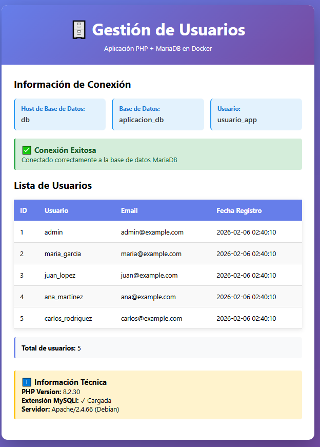

---

## 🔹 Parte 4: Configuración y personalización

### Tarea 4.1: Modificación de variables de entorno

**Credenciales modificadas:**

```yaml
services:
  app:
    # ... otras configuraciones ...
    environment:
      DB_HOST: db
      DB_USER: nuevo_usuario       #  CAMBIO
      DB_PASS: nueva_password       #  CAMBIO
      DB_NAME: nueva_base_datos     #  CAMBIO

  db:
    # ... otras configuraciones ...
    environment:
      MYSQL_ROOT_PASSWORD: root_password_seguro
      MYSQL_DATABASE: nueva_base_datos    #  CAMBIO
      MYSQL_USER: nuevo_usuario           # CAMBIO 
      MYSQL_PASSWORD: nueva_password      #  CAMBIO 
```

**Captura del docker-compose.yml modificado:**

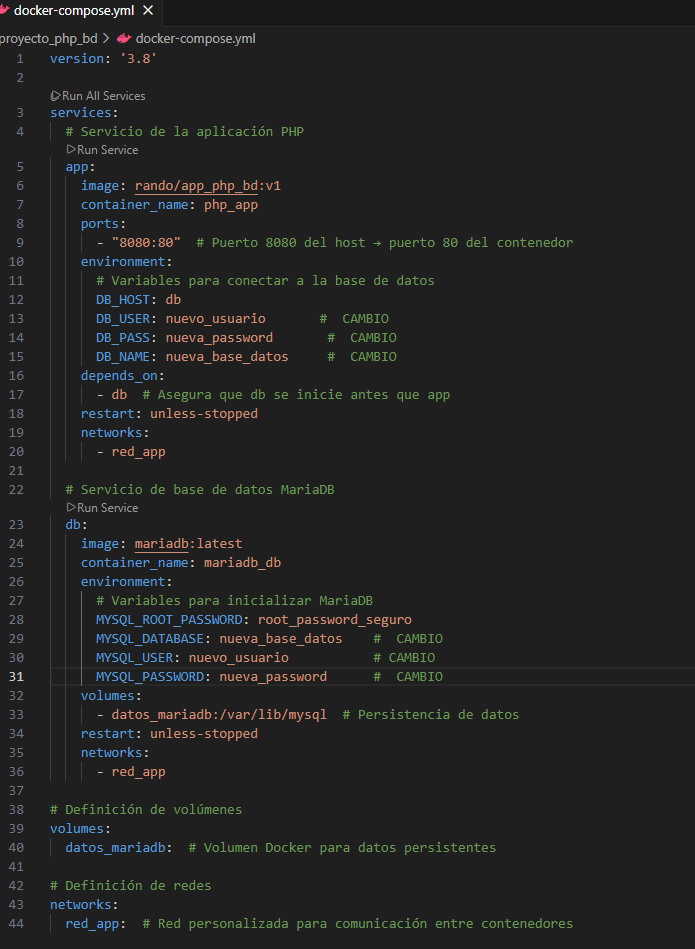

**Captura de la aplicación con nuevas credenciales:**

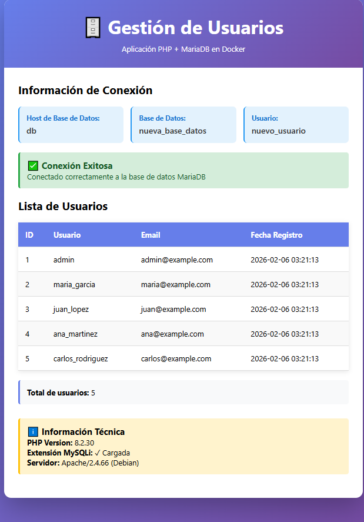

**Pregunta:** ¿Qué pasó con los datos anteriores? ¿Por qué?

> [Desaparecieron, porque al cambiar los nombres de la bbdd en las variables de entorno mariadb crea una nueva base de datos vacia y le ejecuta el script.sh y genera los 5 usuarios iniciales nuevamente]

---

### Tarea 4.2: Archivo `.env`

**Contenido del archivo `.env`:**

```bash
# Configuración de la aplicación
APP_DB_HOST=db
APP_DB_USER=usuario_app
APP_DB_PASS=password_seguro
APP_DB_NAME=usuarios_db

# Puertos
APP_PORT=8080
# Configuración de la base de datos
MYSQL_ROOT_PASSWORD=mi_password_root_seguro
MYSQL_DATABASE=usuarios_db
MYSQL_USER=usuario_app
MYSQL_PASSWORD=password_seguro

```

**Captura del archivo .env:**

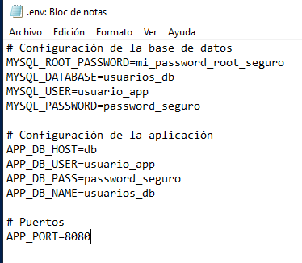

**docker-compose.yml usando variables del .env:**

```yaml
version: '3.8'

services:
  app:
    image: rando/app_php_bd:v1
    container_name: php_app
    ports:
      - "${APP_PORT}:80"  #  Usa variable del .env
    environment:
      DB_HOST: ${APP_DB_HOST}
      DB_USER: ${APP_DB_USER}
      DB_PASS: ${APP_DB_PASS}
      DB_NAME: ${APP_DB_NAME}
    depends_on:
      - db
    restart: unless-stopped
    networks:
      - red_app

  db:
    image: mariadb:latest
    container_name: mariadb_db
    environment:
      MYSQL_ROOT_PASSWORD: ${MYSQL_ROOT_PASSWORD}
      MYSQL_DATABASE: ${MYSQL_DATABASE}
      MYSQL_USER: ${MYSQL_USER}
      MYSQL_PASSWORD: ${MYSQL_PASSWORD}
    volumes:
      - datos_mariadb:/var/lib/mysql
    restart: unless-stopped
    networks:
      - red_app

volumes:
  datos_mariadb:

networks:
  red_app:
```

**Captura del funcionamiento con .env:**

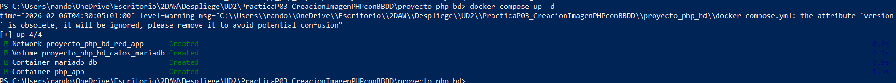
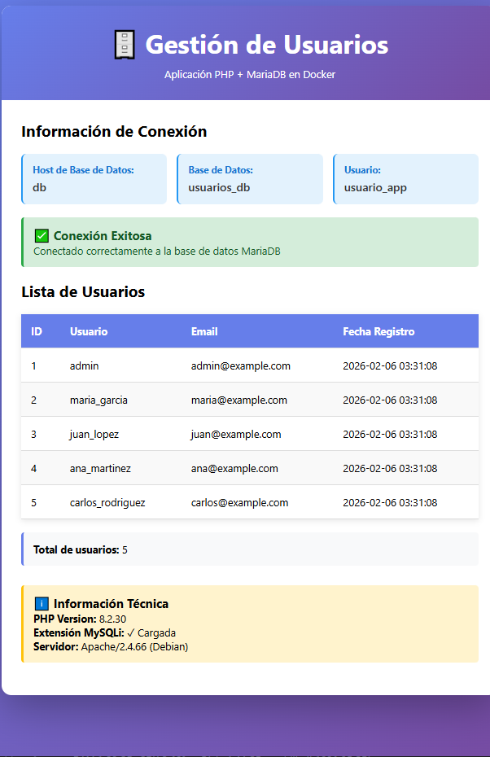
---

### Tarea 4.3: Agregar más datos

**Acceso al contenedor de MariaDB:**
**Conexión a la base de datos:**

```bash
docker exec -it nombre_del_contenedor mariadb -u usuario_app -p usuarios_db
```

**Inserción de usuarios adicionales:**

```sql
INSERT INTO users (username, email, password) VALUES
('nuevo_usuario1', 'nuevo1@example.com', 'pass001'),
('nuevo_usuario2', 'nuevo2@example.com', 'pass002'),
('nuevo_usuario3', 'nuevo3@example.com', 'pass003');
```

**Captura del proceso de inserción:**

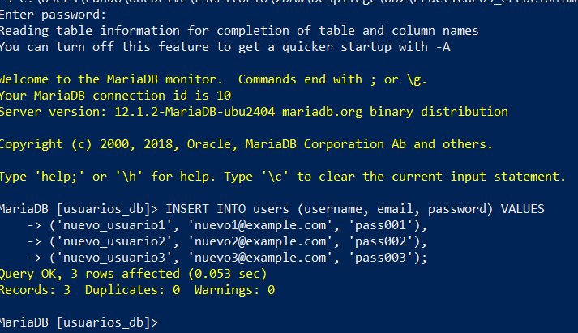
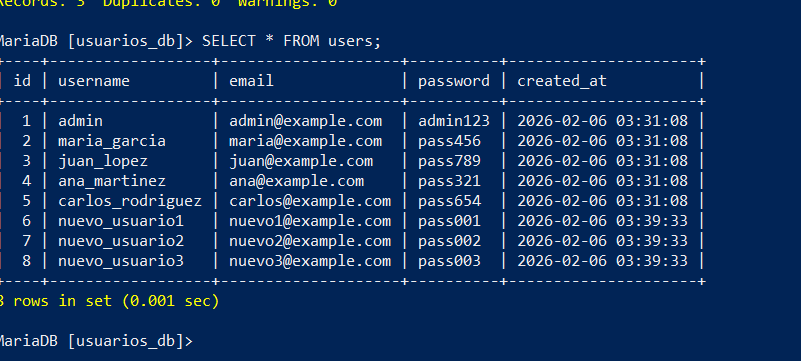

**Captura de la aplicación mostrando los nuevos usuarios:**

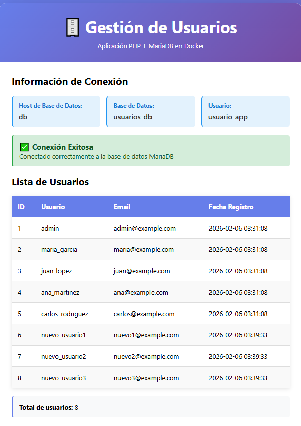

---

## 🔹 Parte 5: Persistencia y gestión de datos

### Tarea 5.1: Verificación de persistencia

**Eliminar solo contenedores (manteniendo volúmenes):**

```bash
docker-compose down
```

**Volver a desplegar:**

```bash
docker-compose up -d
```

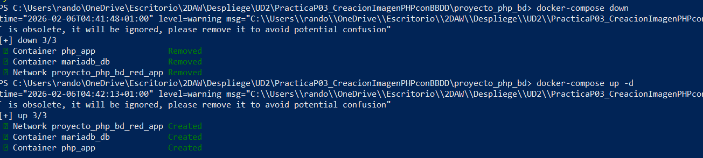

**Captura verificando persistencia de datos:**


**Pregunta:** ¿Por qué los datos insertados desde la web persisten pero el script se ejecuta de nuevo?

> [Los datos persisten porque están en el volumen Docker
El script se ejecuta porque es parte del CMD del contenedor
Pero el script tiene CREATE TABLE IF NOT EXISTS, así que no sobrescribe datos existentes]

---

### Tarea 5.2: Reinicio limpio

**Detener y eliminar todo (incluyendo volúmenes):**

```bash
docker-compose down -v
```

**Volver a desplegar:**

```bash
docker-compose up -d
```

**Captura mostrando solo usuarios iniciales:**

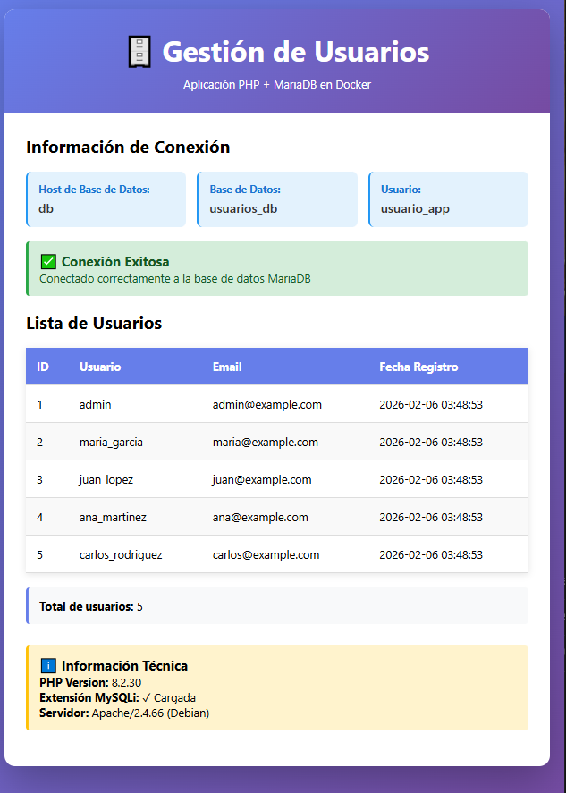

**Explicación de lo sucedido:**

> [Al eliminar el volumen, se pierden todos los datos
MariaDB crea una nueva BD vacía
El script vuelve a ejecutarse e inserta los 5 usuarios del schema.sql
Es un reinicio completamente limpio]

---

### Tarea 5.3: Backup de la base de datos

**Realizar backup:**

```bash
docker exec mariadb_db mariadb-dump -u usuario_app -ppassword_seguro usuarios_db > backup.sql
```

**Captura del proceso de backup:**

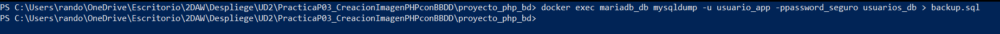

**Eliminar escenario completo:**

```bash
docker-compose down -v
```

**Recrear escenario:**

```bash
docker-compose up -d
```

**Restaurar backup:**

```bash
Get-Content backup.sql | docker exec -i mariadb_db mariadb -u usuario_app -ppassword_seguro usuarios_db
```

**Captura de la restauración exitosa:**

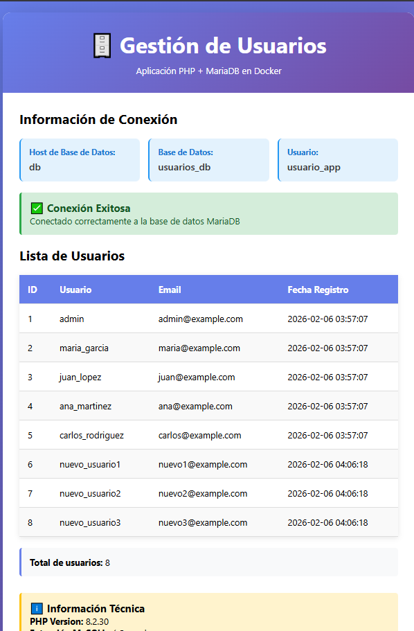
---

## 🔹 Parte 6: Mejoras y optimización

### Tarea 6.1: Mejora del script de inicialización

**Script mejorado (`script.sh`):**
(reemplazo inicializar la base de datos por :)
```bash
# Verificar si la tabla existe
echo "Verificando si la base de datos ya está inicializada..."
TABLE_EXISTS=$(mysql -u "${DB_USER}" -p"${DB_PASS}" -h "${DB_HOST}" "${DB_NAME}" \
  -sse "SELECT COUNT(*) FROM information_schema.tables WHERE table_schema='${DB_NAME}' AND table_name='users';")

if [ "$TABLE_EXISTS" -eq "0" ]; then
    echo "Base de datos vacía. Inicializando por primera vez..."
    if mysql -u "${DB_USER}" -p"${DB_PASS}" -h "${DB_HOST}" "${DB_NAME}" < /opt/schema.sql; then
        echo "✓ Base de datos inicializada correctamente"
    else
        echo "ERROR: Fallo al inicializar la base de datos"
        exit 1
    fi
else
    echo "✓ Base de datos ya inicializada. Omitiendo schema.sql"
fi
```

recontruir imagen 
```bash
    docker build -t rando/app_php_bd:v1 .
```
me cree un usuario 
```bash
docker exec -i mariadb_db mariadb -u usuario_app -ppassword_seguro usuarios_db -e "INSERT INTO users (username, email, password) VALUES ('test', 'test@test.com', 'test123');"
```
**Captura del comportamiento mejorado:**

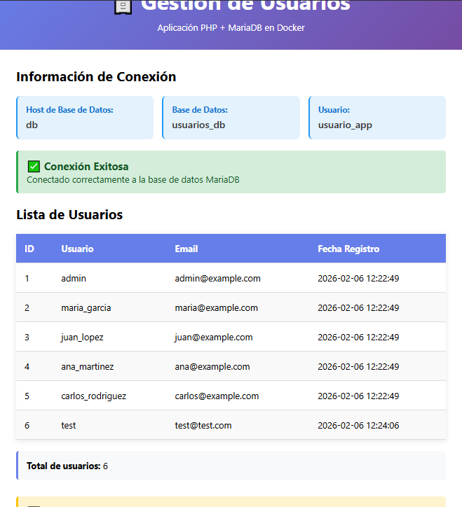

---

### Tarea 6.2: Healthchecks

**docker-compose.yml con healthchecks:**

```yaml
version: '3.8'

services:
  app:
    image: rando/app_php_bd:v1
    container_name: php_app
    ports:
      - "${APP_PORT}:80"
    environment:
      DB_HOST: ${APP_DB_HOST}
      DB_USER: ${APP_DB_USER}
      DB_PASS: ${APP_DB_PASS}
      DB_NAME: ${APP_DB_NAME}
    depends_on:
      db:
        condition: service_healthy  #  Espera a que db esté "healthy"
    restart: unless-stopped
    networks:
      - red_app
    healthcheck:  # NUEVO :D
      test: ["CMD", "curl", "-f", "http://localhost"]
      interval: 30s
      timeout: 3s
      retries: 3
      start_period: 40s

  db:
    image: mariadb:latest
    container_name: mariadb_db
    environment:
      MYSQL_ROOT_PASSWORD: ${MYSQL_ROOT_PASSWORD}
      MYSQL_DATABASE: ${MYSQL_DATABASE}
      MYSQL_USER: ${MYSQL_USER}
      MYSQL_PASSWORD: ${MYSQL_PASSWORD}
    volumes:
      - datos_mariadb:/var/lib/mysql
    restart: unless-stopped
    networks:
      - red_app
    healthcheck:  #  NUEVO :D
      test: ["CMD", "mysqladmin", "ping", "-h", "localhost"]
      interval: 10s
      timeout: 5s
      retries: 5
      start_period: 30s

volumes:
  datos_mariadb:

networks:
  red_app:
  ```
(docker compose down and up )

**Captura del estado de health:**

```bash
docker ps
```

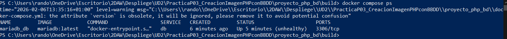
(Error de tema de ping como no está instalado vamos a usar en vez de ping --connet)
      test: ["CMD", "healthcheck.sh", "--connect", "--innodb_initialized"]
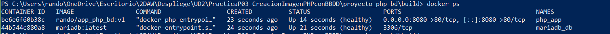
(ahora si)
---

### Tarea 6.3: Añadir funcionalidad a la aplicación

**Archivo `build/app/agregar.php`:**

```php
<?php
// Procesar el formulario si se envió
$mensaje = '';
$tipo = '';

if ($_SERVER['REQUEST_METHOD'] === 'POST') {
    $username = trim($_POST['username'] ?? '');
    $email = trim($_POST['email'] ?? '');
    $password = trim($_POST['password'] ?? '');
    
    // Validar campos
    if (empty($username) || empty($email) || empty($password)) {
        $mensaje = 'Todos los campos son obligatorios';
        $tipo = 'error';
    } elseif (!filter_var($email, FILTER_VALIDATE_EMAIL)) {
        $mensaje = 'El formato del email no es válido';
        $tipo = 'error';
    } else {
        // Conectar a la BD
        $host = getenv('DB_HOST');
        $user = getenv('DB_USER');
        $pass = getenv('DB_PASS');
        $db = getenv('DB_NAME');
        
        $conn = new mysqli($host, $user, $pass, $db);
        
        if ($conn->connect_error) {
            $mensaje = 'Error de conexión: ' . $conn->connect_error;
            $tipo = 'error';
        } else {
            // Preparar e insertar
            $stmt = $conn->prepare("INSERT INTO users (username, email, password) VALUES (?, ?, ?)");
            $stmt->bind_param("sss", $username, $email, $password);
            
            if ($stmt->execute()) {
                $mensaje = 'Usuario agregado exitosamente';
                $tipo = 'success';
                // Limpiar campos
                $username = $email = $password = '';
            } else {
                if ($conn->errno === 1062) {
                    $mensaje = 'El nombre de usuario ya existe';
                } else {
                    $mensaje = 'Error al insertar: ' . $conn->error;
                }
                $tipo = 'error';
            }
            
            $stmt->close();
            $conn->close();
        }
    }
}
?>
<!DOCTYPE html>
<html lang="es">
<head>
    <meta charset="UTF-8">
    <meta name="viewport" content="width=device-width, initial-scale=1.0">
    <title>Agregar Usuario - Docker</title>
    <style>
        * {
            margin: 0;
            padding: 0;
            box-sizing: border-box;
        }
        body {
            font-family: 'Segoe UI', Tahoma, Geneva, Verdana, sans-serif;
            background: linear-gradient(135deg, #667eea 0%, #764ba2 100%);
            min-height: 100vh;
            padding: 20px;
        }
        .container {
            max-width: 600px;
            margin: 0 auto;
            background: white;
            border-radius: 15px;
            box-shadow: 0 20px 60px rgba(0,0,0,0.3);
            overflow: hidden;
        }
        .header {
            background: linear-gradient(135deg, #667eea 0%, #764ba2 100%);
            color: white;
            padding: 30px;
            text-align: center;
        }
        .content {
            padding: 30px;
        }
        .form-group {
            margin-bottom: 20px;
        }
        label {
            display: block;
            margin-bottom: 5px;
            font-weight: 600;
            color: #333;
        }
        input[type="text"],
        input[type="email"],
        input[type="password"] {
            width: 100%;
            padding: 12px;
            border: 2px solid #ddd;
            border-radius: 5px;
            font-size: 16px;
            transition: border-color 0.3s;
        }
        input:focus {
            outline: none;
            border-color: #667eea;
        }
        .btn {
            background: linear-gradient(135deg, #667eea 0%, #764ba2 100%);
            color: white;
            padding: 12px 30px;
            border: none;
            border-radius: 5px;
            font-size: 16px;
            font-weight: 600;
            cursor: pointer;
            width: 100%;
            margin-top: 10px;
        }
        .btn:hover {
            opacity: 0.9;
        }
        .mensaje {
            padding: 15px;
            border-radius: 5px;
            margin-bottom: 20px;
            font-weight: 600;
        }
        .success {
            background: #d4edda;
            color: #155724;
            border: 1px solid #c3e6cb;
        }
        .error {
            background: #f8d7da;
            color: #721c24;
            border: 1px solid #f5c6cb;
        }
        .link {
            text-align: center;
            margin-top: 20px;
        }
        .link a {
            color: #667eea;
            text-decoration: none;
            font-weight: 600;
        }
        .link a:hover {
            text-decoration: underline;
        }
    </style>
</head>
<body>
    <div class="container">
        <div class="header">
            <h1>➕ Agregar Usuario</h1>
            <p>Formulario de registro</p>
        </div>
        
        <div class="content">
            <?php if ($mensaje): ?>
                <div class="mensaje <?= $tipo ?>">
                    <?= htmlspecialchars($mensaje) ?>
                </div>
            <?php endif; ?>
            
            <form method="POST" action="">
                <div class="form-group">
                    <label for="username">Nombre de usuario:</label>
                    <input type="text" id="username" name="username" 
                           value="<?= htmlspecialchars($username ?? '') ?>" required>
                </div>
                
                <div class="form-group">
                    <label for="email">Correo electrónico:</label>
                    <input type="email" id="email" name="email" 
                           value="<?= htmlspecialchars($email ?? '') ?>" required>
                </div>
                
                <div class="form-group">
                    <label for="password">Contraseña:</label>
                    <input type="password" id="password" name="password" required>
                </div>
                
                <button type="submit" class="btn">Agregar Usuario</button>
            </form>
            
            <div class="link">
                <a href="index.php">← Volver a la lista de usuarios</a>
            </div>
        </div>
    </div>
</body>
</html>
```
(para reconstruir la imagen)
docker build -t rando/app_php_bd:v1 .

(hay que añadir la fomra de acceder a agregar php justo despues de decir el total de usuarios)
```bash
                echo '<div style="text-align: center; margin-top: 20px;">';
                echo '<a href="agregar.php" style="display: inline-block; background: linear-gradient(135deg, #667eea 0%, #764ba2 100%); color: white; padding: 12px 30px; border-radius: 5px; text-decoration: none; font-weight: 600;">➕ Agregar Nuevo Usuario</a>';
                echo '</div>';

```
**Captura del formulario funcionando:**

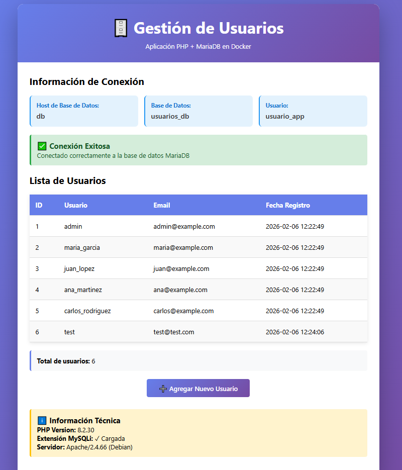
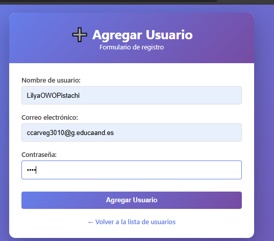
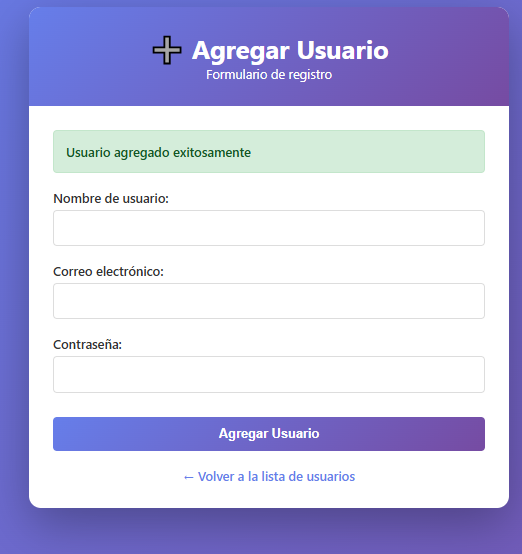
**Captura de usuario agregado exitosamente:**

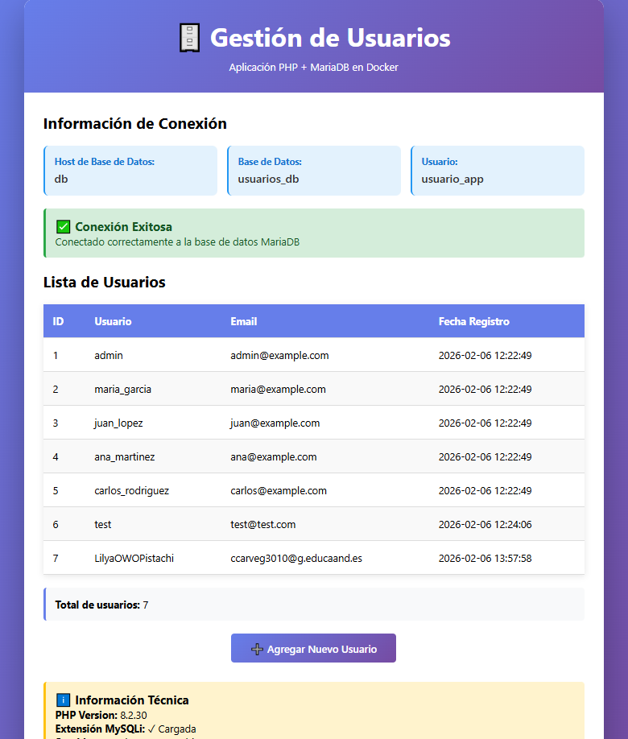
---

## 🔹 Parte 7: Análisis y documentación

### Tarea 7.1: Preguntas de reflexión

#### Sobre variables de entorno:

1. **¿Por qué es mejor usar variables de entorno que hardcodear valores?**
   
   > [Seguridad: Las credenciales no quedan expuestas en el código fuente(y se pueden meter dentro del git ignore)
Flexibilidad: Puedes cambiar configuración sin modificar código(más comodidad)
Portabilidad: El mismo código funciona en diferentes entornos
Escalabilidad: Facilita la gestión en múltiples servidores]

2. **¿Qué riesgos de seguridad existen al usar variables de entorno?**
   
   > [Pueden verse en docker inspect
Aparecen en logs si no tienes cuidado
Se pueden leer desde procesos dentro del contenedor
Si alguien accede al host, puede verlas
En algunos sistemas cloud quedan registradas]

3. **¿Cómo mejorarías la seguridad de las credenciales?**
   
   > [Usar Docker Secrets (en Docker Swarm)
Usar Kubernetes Secrets
Usar herramientas como Vault de HashiCorp
Cifrar variables sensibles]

#### Sobre el script de inicialización:

1. **¿Por qué necesitamos esperar a que MariaDB esté lista?**
   
   > [MariaDB tarda varios segundos en iniciar completamente
Aunque el contenedor esté "running", el servicio puede no estar listo
Si intentamos conectar antes de tiempo, fallará
Docker puede iniciar ambos contenedores casi simultáneamente
Necesitamos sincronización para evitar errores]

2. **¿Qué pasaría si no esperamos?**
   
   > [El script intentaría conectarse a MariaDB antes de que esté lista
La conexión fallaría con error "Connection refused"
El script terminaría con error
El contenedor PHP se detendría
La aplicación no funcionaría
Tendríamos que reiniciar manualmente]

3. **¿Hay alternativas mejores al bucle `while`?**
   
   > [Healthchecks de Docker Compose con depends_on: condition: service_healthy
Usar herramientas como wait-for-it.sh o dockerize
Usar docker-compose-wait]

#### Sobre la arquitectura:

1. **¿Por qué separar la aplicación y la BD en contenedores diferentes?**
   
   > [Principio de responsabilidad única: Cada contenedor hace una cosa
Escalabilidad: Puedes escalar app y BD independientemente
Mantenimiento: Actualizas una sin afectar la otra
Seguridad: Aíslas componentes
Reutilización: Puedes usar la misma BD para múltiples apps]

2. **¿Cuáles son las ventajas?**
   
   > [Modularidad: Componentes intercambiables
Escalabilidad horizontal: Puedes tener N instancias de app con 1 BD
Facilidad de actualización: Actualizas PHP sin tocar MariaDB
Mejor uso de recursos: Cada contenedor optimizado para su tarea]

3. **¿Cuáles son las desventajas?**
   
   > [Complejidad: Más componentes que gestionar
Latencia de red: Comunicación entre contenedores tiene overhead
Orquestación: Necesitas Docker Compose u otra herramienta]

#### Sobre persistencia:

1. **¿Por qué es importante persistir los datos de la BD?**
   
   > [Los contenedores son volatiles por naturaleza
Si eliminas el contenedor, pierdes todos los datos
Los datos de usuarios, transacciones, etc. deben sobrevivir
Permite actualizaciones sin pérdida de datos
Facilita backups y recuperación ante desastres]

2. **¿Qué pasa si no usas volúmenes?**
   
   > [Cada vez que eliminas el contenedor, pierdes TODOS los datos
Cada reinicio es como empezar de cero]

3. **¿Cuándo usarías volúmenes vs bind mounts?**
   
   > [Volúmenes Docker:

Datos de bases de datos
Datos que no necesitas editar desde el host
Producción
Mejor rendimiento
Gestionados completamente por Docker

Bind mounts:

Desarrollo (código fuente que editas constantemente)
Archivos de configuración que cambias frecuentemente
Logs que quieres ver fácilmente en el host
Cuando necesitas acceso directo desde el host]

---

### Tarea 7.2: Diagrama de la arquitectura

Crea un diagrama que muestre:

- Los dos contenedores y sus componentes
- Las variables de entorno que usa cada uno
- El volumen de persistencia
- La red que los conecta
- Los puertos expuestos
- El flujo de datos desde el navegador hasta la BD

**Diagrama de arquitectura:**

┌─────────────────────────────────────────────────────────────┐
│                        NAVEGADOR                            │
│                    http://localhost:8080                    │
└────────────────────────┬────────────────────────────────────┘
                         │
                         │ HTTP Request
                         ▼
┌─────────────────────────────────────────────────────────────┐
│                    HOST (Puerto 8080)                       │
└────────────────────────┬────────────────────────────────────┘
                         │
                         │ Port Mapping: 8080:80
                         ▼
┌────────────────────────────────────────────────────────────┐
│                  RED DOCKER: red_app                       │
│                                                            │
│  ┌──────────────────────────┐  ┌─────────────────────────┐│
│  │  CONTENEDOR: php_app     │  │ CONTENEDOR: mariadb_db  ││
│  │  Imagen: app_php_bd:v1   │  │ Imagen: mariadb:latest  ││
│  │  Puerto: 80              │  │ Puerto: 3306 (interno)  ││
│  │                          │  │                         ││
│  │  ENV:                    │  │ ENV:                    ││
│  │  - DB_HOST=db            │  │ - MYSQL_DATABASE        ││
│  │  - DB_USER=usuario_app   │  │ - MYSQL_USER            ││
│  │  - DB_PASS=password_seg  │  │ - MYSQL_PASSWORD        ││
│  │  - DB_NAME=usuarios_db   │  │ - MYSQL_ROOT_PASSWORD   ││
│  │                          │  │                         ││
│  │  Componentes:            │  │                         ││
│  │  ├─ Apache HTTP Server   │  │  /var/lib/mysql ◄──┐    ││
│  │  ├─ PHP 8.2              │  │                    │    ││
│  │  ├─ Extensión mysqli     │  │                    │    ││
│  │  ├─ script.sh            │  │                    │    ││
│  │  ├─ index.php            │  │                    │    ││
│  │  ├─ agregar.php          │  │                    │    ││
│  │  └─ schema.sql           │  │                    │    ││
│  │                          │  │                    │    ││
│  └──────────┬───────────────┘  └────────────────────┘    ││
│             │                                             ││
│             │ MySQL Connection (mysqli)                   ││
│             │ Host: db, Port: 3306                        ││
│             └──────────────────────────────────────────►  ││
│                                                            │
└────────────────────────────────────────────────────────────┘
                                    │
                                    │ Persistencia
                                    ▼
                      ┌──────────────────────────┐
                      │  VOLUMEN: datos_mariadb  │
                      │  (Gestionado por Docker) │
                      └──────────────────────────┘

FLUJO DE DATOS:
1. Usuario accede a http://localhost:8080
2. Solicitud llega al puerto 8080 del host
3. Docker mapea 8080 → 80 del contenedor php_app
4. Apache recibe la petición
5. PHP procesa index.php o agregar.php
6. PHP lee variables de entorno (DB_HOST, DB_USER, etc.)
7. PHP se conecta a MariaDB usando mysqli
8. MariaDB consulta/inserta datos en /var/lib/mysql
9. Los datos se persisten en el volumen datos_mariadb
10. PHP genera HTML y lo devuelve a Apache
11. Apache envía respuesta HTTP al navegador
---


---

## 📚 Referencias

- [Documentación oficial de Docker](https://docs.docker.com/)
- [Imagen oficial PHP en Docker Hub](https://hub.docker.com/_/php)
- [Imagen oficial MariaDB en Docker Hub](https://hub.docker.com/_/mariadb)
- [Docker Compose Reference](https://docs.docker.com/compose/compose-file/)
