# PRIMERA PARTE: Gestión Manual con Docker

## Descripción general

Esta primera parte se centra en comprender cada componente y comando Docker necesario para desplegar la arquitectura. Aprenderás a gestionar redes, contenedores, volúmenes y configuraciones de forma manual.

---

## 🔹 Parte 1: Preparación del entorno

### Tarea 1.1: Obtención de recursos

- **Crea un directorio de trabajo** para esta práctica (ej: `~/tomcat_practica`)
  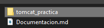
- **Obtén un archivo WAR**:
  - Descargar `sample.war` del repositorio (carpeta `recursos`)
    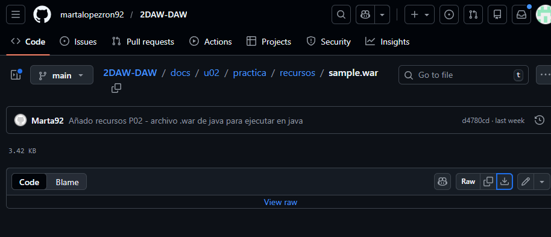
  - Consulta el README para instrucciones detalladas
    docker run --rm -v ${PWD}:/data tomcat:9.0 jar -tvf /data/sample.war
    Para comprobar que va bien el war
  - O utiliza cualquier WAR disponible

- **Crea el archivo de configuración `default.conf`** para Nginx: - Escucha en puerto 80 - Configuración de `location /` con `proxy_pass` - Proxy apunta a `NOMBRE_CONTENEDOR_TOMCAT:8080/NOMBRE_APLICACION` - Gestión de errores (500, 502, 503, 504)
  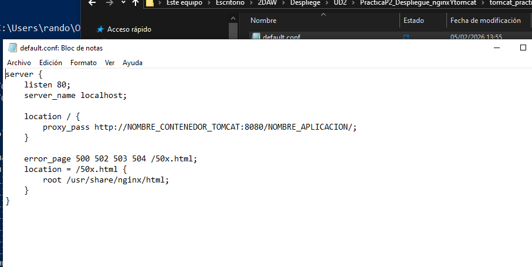
- **Verifica los archivos**: `sample.war` y `default.conf`

### Tarea 1.2: Creación de la red

```bash
docker network create red_tomcat
docker network ls
```

## 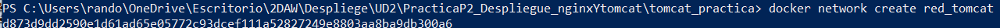

## 🔹 Parte 2: Despliegue del servidor Tomcat

### Tarea 2.1: Despliegue básico de Tomcat

```bash
docker run -d ^
 --name aplicacionjava ^
 --network red_tomcat ^
 -v ${PWD}/sample.war:/usr/local/tomcat/webapps/sample.war ^
 tomcat:9.0
```

    ${PWD} es el directorio actual en power shell

**Verificaciones**:

- Estado del contenedor: `docker ps`
  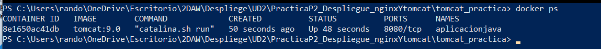
- Logs: `docker logs aplicacionjava`
  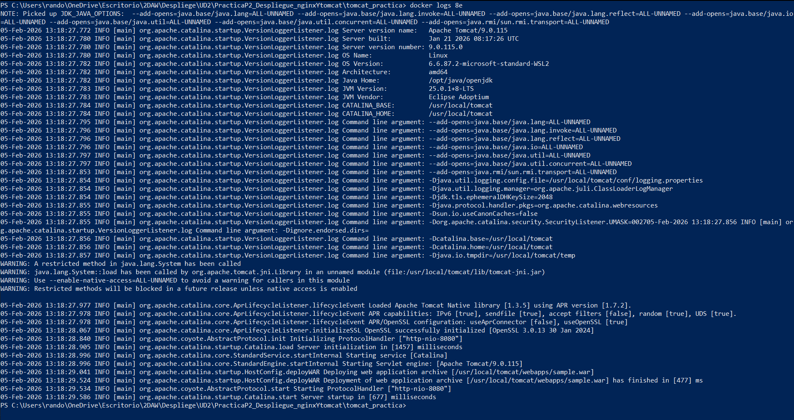
- Acceso al contenedor: `docker exec -it aplicacionjava bash`
- Archivo WAR desplegado: `/usr/local/tomcat/webapps/`
  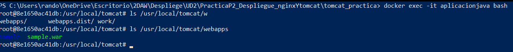

---

## 🔹 Parte 3: Configuración y despliegue de Nginx

### Tarea 3.1: Configuración del proxy inverso

Actualiza `default.conf`:

- Sustituye `NOMBRE_CONTENEDOR_TOMCAT` → `aplicacionjava`
- Sustituye `NOMBRE_APLICACION` → `sample`
  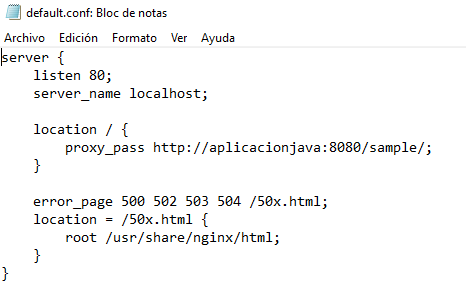
- Verifica directivas: `listen`, `server_name`, `location`, `proxy_pass`
  server {
  listen 80;
  server_name localhost;

      location / {
          proxy_pass http://aplicacionjava:8080/sample/;
          proxy_set_header Host $host;
          proxy_set_header X-Real-IP $remote_addr;
          proxy_set_header X-Forwarded-For $proxy_add_x_forwarded_for;
          proxy_set_header X-Forwarded-Proto $scheme;
      }

      error_page 500 502 503 504 /50x.html;
      location = /50x.html {
          root /usr/share/nginx/html;
      }

  }

### Tarea 3.2: Despliegue de Nginx

```bash
docker run -d `
 --name proxy `
 --network red_tomcat `
 -p 80:80 `
 -v ${PWD}/default.conf:/etc/nginx/conf.d/default.conf:ro `
 nginx:latest

```
(ro es read only)

**Verificaciones**:

- Estado: `docker ps`
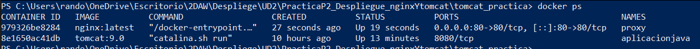
- Logs: `docker logs proxy`
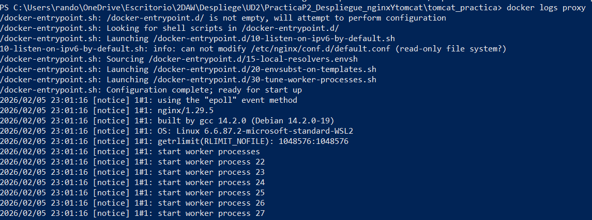


### Tarea 3.3: Verificación del despliegue

- Accede a `http://localhost` en el navegador
- Verifica que la aplicación se carga correctamente a través de Nginx
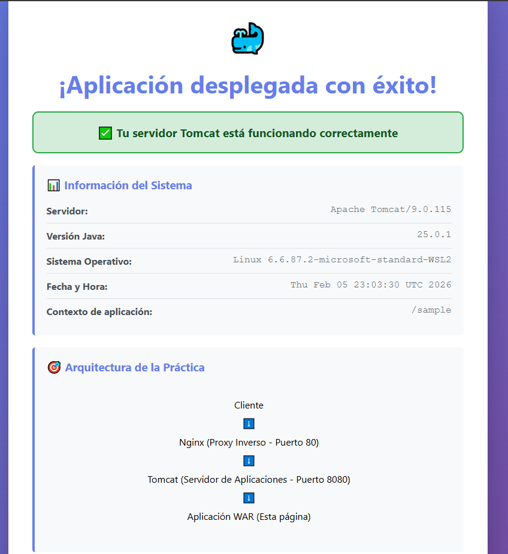
---
# 🔹 Parte 4: Análisis de la arquitectura

## Tarea 4.1: Flujo de peticiones

### Flujo completo de una petición HTTP

1. El navegador del cliente envía una petición HTTP a `http://localhost` (puerto 80).

2. **Nginx** es el primer componente que recibe la petición, ya que expone el puerto 80 al host.

3. Nginx utiliza la directiva `proxy_pass` para reenviar la petición al servicio de Tomcat en la dirección:
```
   http://aplicacionjava:8080/sample/
```

4. El nombre `aplicacionjava` se resuelve correctamente gracias al **DNS interno de Docker**, ya que ambos contenedores están conectados a la red `red_tomcat`.

5. **Tomcat** recibe la petición en el puerto 8080, procesa la aplicación Java desplegada en formato WAR y genera la respuesta HTTP.

6. Tomcat devuelve la respuesta a Nginx, que a su vez la reenvía al navegador del cliente.

### Pruebas de conectividad entre contenedores

**Intento de ping desde Nginx a Tomcat:**
```bash
docker exec proxy ping aplicacionjava
```

La imagen oficial de Nginx es minimalista y no incluye la herramienta `ping`, por lo que este comando no está disponible dentro del contenedor, así que me instalo inetutils-ping y hago ping.
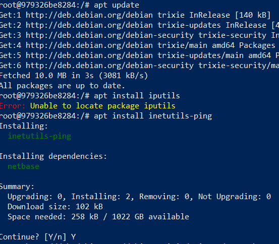
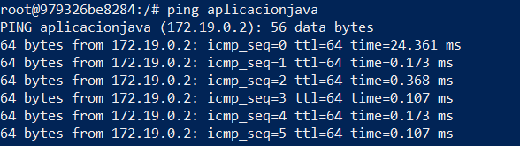
(ole)


**Verificación de conectividad HTTP:**
```bash
docker run --rm --network red_tomcat curlimages/curl \
  curl http://aplicacionjava:8080/sample
```
La correcta respuesta HTTP confirma que existe conectividad entre los contenedores y que la resolución DNS funciona correctamente dentro de la red Docker.
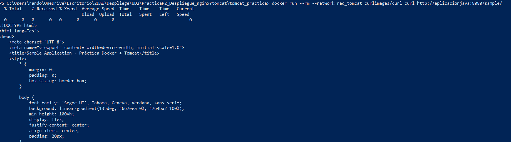 
Funciona :D
---

## Tarea 4.2: Bind mount vs Volúmenes Docker

### Bind mounts

Se utilizan cuando se necesita montar archivos o directorios específicos del host dentro del contenedor.

**Son ideales para:**
- Archivos de configuración (ej. `default.conf`)
- Aplicaciones en desarrollo

**Ventajas:**
- Cambios inmediatos sin reconstruir imágenes
- Fácil edición desde el host

**Desventajas:**
- Dependencia de la estructura del sistema host
- Menor portabilidad entre sistemas

### Volúmenes Docker

Son gestionados completamente por Docker.

**Son más apropiados para:**
- Datos persistentes
- Bases de datos

**Ventajas:**
- Mayor portabilidad
- Mejor aislamiento

**Desventajas:**
- Menos accesibles directamente desde el host

### Verificación en el host

Los archivos montados mediante bind mount se encuentran en:
- `sample.war` → `$(pwd)/sample.war`
- `default.conf` → `$(pwd)/default.conf`

---

## Tarea 5.1: Modificación de la configuración de Nginx

Las siguientes cabeceras HTTP se añaden para preservar información del cliente original:
```nginx
proxy_set_header Host $host;
proxy_set_header X-Real-IP $remote_addr;
proxy_set_header X-Forwarded-For $proxy_add_x_forwarded_for;
proxy_set_header X-Forwarded-Proto $scheme;
```

**Función de cada cabecera:**
- **Host**: conserva el nombre del host solicitado por el cliente
- **X-Real-IP**: IP real del cliente
- **X-Forwarded-For**: cadena de IPs por las que ha pasado la petición
- **X-Forwarded-Proto**: protocolo usado (HTTP/HTTPS)

### Recarga de configuración sin detener el contenedor
```bash
docker exec proxy nginx -s reload
```
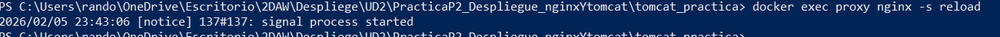

---

## Tarea 5.2: Acceso directo a Tomcat

### Diferencias entre acceso directo y acceso vía proxy

| Aspecto     | Acceso directo | Acceso vía Nginx |
|-------------|----------------|------------------|
| Puerto      | 8080           | 80               |
| Seguridad   | Menor          | Mayor            |
| Exposición  | Directa        | Controlada       |
| Cabeceras   | Básicas        | Enriquecidas     |

### Reflexión

En producción no se suele exponer Tomcat directamente porque:
- No gestiona bien TLS
- No está optimizado para tráfico directo
- Se pierde control de seguridad y filtrado

---

## Tarea 5.3: Múltiples aplicaciones

Permite servir varias aplicaciones Java desde un único Tomcat usando rutas diferentes:
```nginx
location /app1/ {
    proxy_pass http://aplicacionjava:8080/aplicacion1/;
}

location /app2/ {
    proxy_pass http://aplicacionjava:8080/aplicacion2/;
}
```
# SEGUNDA PARTE: Automatización con Docker Compose

En esta segunda parte se retoma el despliegue de **Tomcat con Nginx como proxy inverso**, utilizando **Docker Compose** para simplificar y automatizar la gestión del escenario.

---

## 🔹 Parte 7: Preparación del entorno con Docker Compose

### Tarea 7.1: Estructura de archivos

Se crea un nuevo directorio de trabajo:

```bash
tomcat_compose/
├── docker-compose.yml
├── default.conf
└── sample.war
```

* **sample.war**: aplicación Java usada en la primera parte.
* **default.conf**: configuración de Nginx como proxy inverso.

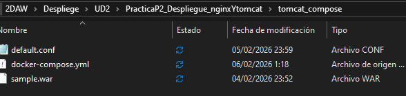

Contenido de `default.conf`:

```nginx
server {
    listen       80;
    listen  [::]:80;
    server_name  localhost;
   
    location / {
        proxy_pass http://aplicacionjava:8080/sample/;
    }
    
    error_page   500 502 503 504  /50x.html;
    location = /50x.html {
        root   /usr/share/nginx/html;
    }
}
```
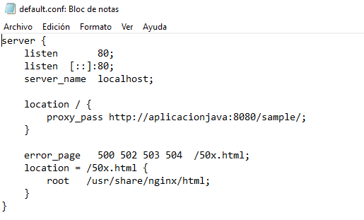

---

### Tarea 7.2: Creación del docker-compose.yml

El archivo `docker-compose.yml` define dos servicios:

* **aplicacionjava (Tomcat)**
* **proxy (Nginx)**

Requisitos aplicados:

* Uso de **bind mounts**
* Montajes en **solo lectura (:ro)**
* Dependencia entre servicios
* Política de reinicio automática

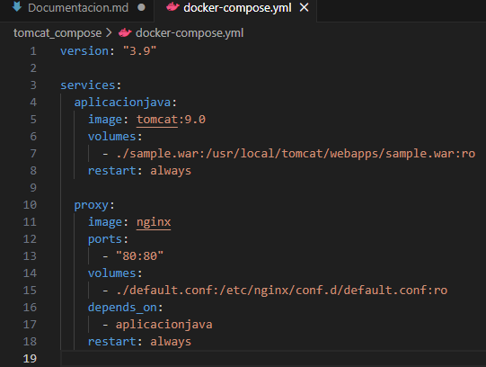

**Análisis**:

* Se usan bind mounts para facilitar edición directa de archivos.
* `:ro` evita modificaciones accidentales dentro del contenedor.
* `depends_on` garantiza que Tomcat se inicie antes que Nginx.
* Tomcat no expone puertos al host por seguridad.
* Los contenedores se comunican mediante DNS interno de Docker Compose.

---

## 🔹 Parte 8: Despliegue y verificación con Compose

### Tarea 8.1: Despliegue del escenario

Desde el directorio del proyecto:

```bash
docker compose up -d
```
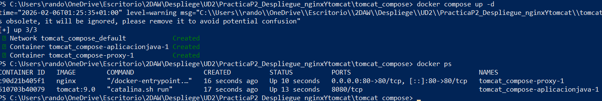

Verificaciones:

* Docker Compose crea una **red automática**.
* Los servicios se inician según dependencias.
* Ambos contenedores quedan en estado *running*.

Acceso a la aplicación:

```
http://localhost
```

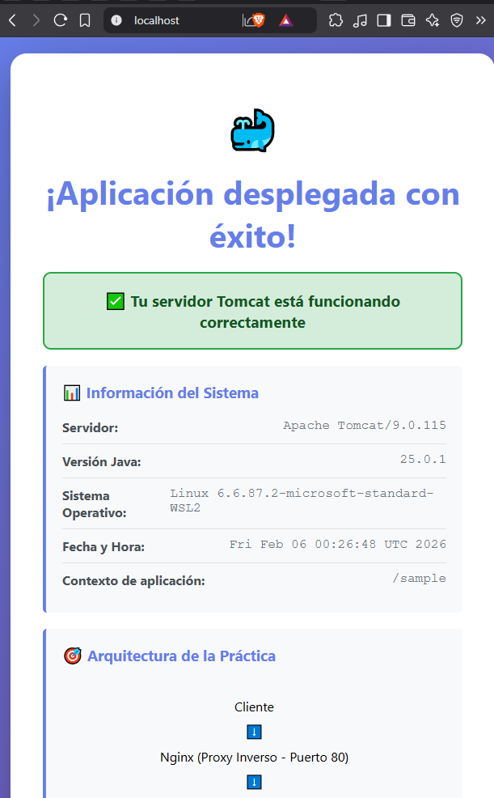

El acceso se realiza a través de **Nginx (puerto 80)**.

**Comparación**:

* Menos comandos que en la primera parte.
* Arquitectura más fácil de documentar y versionar.

---

### Tarea 8.2: Verificación de bind mounts

Comprobaciones:

```bash
docker compose exec aplicacionjava ls /usr/local/tomcat/webapps/
docker compose exec proxy ls /etc/nginx/conf.d/
```
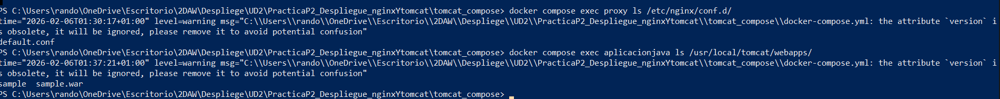

Está bien lo que pasa es que me dice que no es nesesario poner en el yml version:3.9


Modificar `default.conf` en el host y recargar Nginx:

```bash
docker compose exec proxy nginx -s reload
```
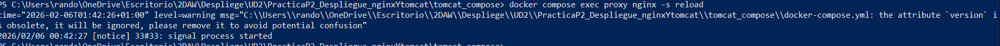

**Conclusión**:

* Compose facilita los cambios de configuración.
* Tener todos los archivos juntos mejora mantenimiento y control.

---

### Tarea 8.3: Análisis de logs

Logs de todos los servicios:

```bash
docker compose logs
```
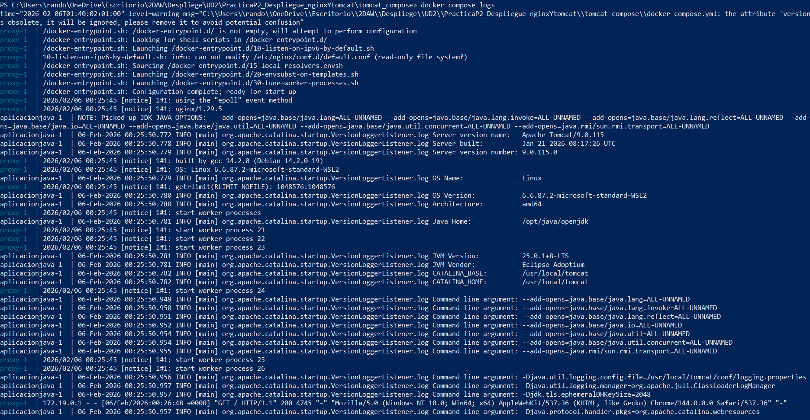

Logs por servicio:

```bash
docker compose logs proxy
docker compose logs aplicacionjava
```
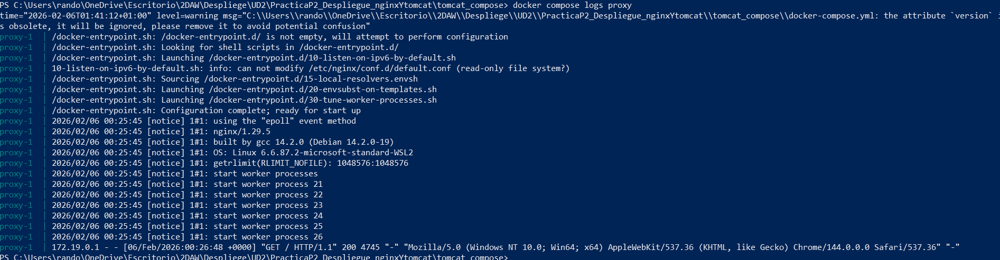
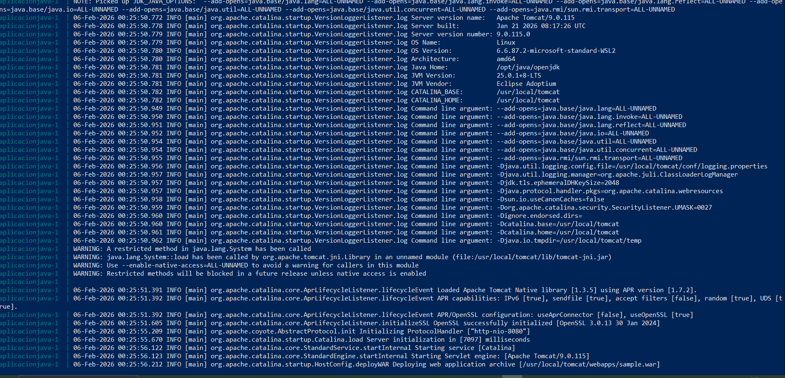

Observaciones:

* Nginx registra las peticiones HTTP.
* Tomcat registra el despliegue del WAR.

---

## 🔹 Parte 9: Configuración avanzada con Compose

### Tarea 9.1: Mejora de la configuración de Nginx

Configuración avanzada en `default.conf`:

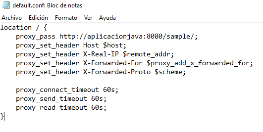

Explicación:

* **Host**: mantiene el dominio original.
* **X-Real-IP**: IP real del cliente.
* **X-Forwarded-For**: historial de proxies.
* **X-Forwarded-Proto**: protocolo usado.
* **Timeouts**: evitan bloqueos prolongados.

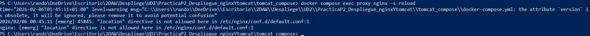

---

### Tarea 9.2: Variables de entorno y customización

Archivo `.env`:

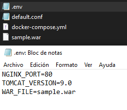

Uso en `docker-compose.yml`:

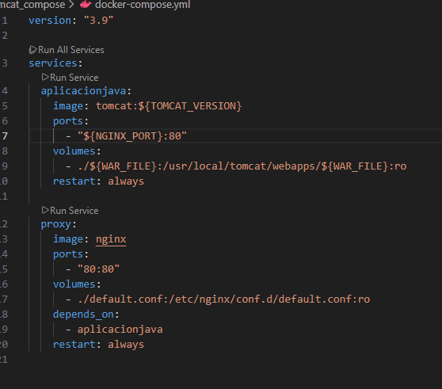


Ventajas:

* Fácil adaptación a dev / test / prod.
* Configuración flexible sin tocar el YAML.

---

## 🔹 Parte 10: Análisis comparativo

### Tarea 10.1: Comparación

| Aspecto             | Gestión manual | Docker Compose |
| ------------------- | -------------- | -------------- |
| Nº de comandos      | Alto           | Bajo           |
| Creación de red     | Manual         | Automática     |
| Montaje de archivos | Manual         | Declarativo    |
| Despliegue WAR      | Manual         | Automatizado   |
| Reproducibilidad    | Media          | Alta           |
| Versionado Git      | Difícil        | Sencillo       |

---

### Tarea 10.2: Conclusiones finales

* Docker Compose simplifica despliegue y mantenimiento.
* El uso de `:ro` mejora seguridad.
* `depends_on` gestiona dependencias, pero no asegura disponibilidad total.
* Variables de entorno facilitan múltiples entornos.
* Compose es más adecuado para producción y escalado.
