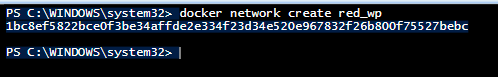
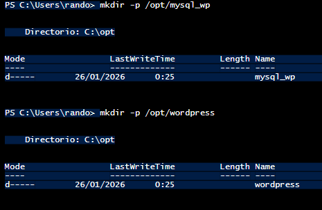

# Práctica 2.1: Despliegue de WordPress con MariaDB

## 🔹 Componentes de la Arquitectura

* **Servidor Web + WordPress:** Apache con PHP y WordPress (Imagen: `wordpress`).
  Puerto 80/tcp.
  Almacena contenido en `/var/www/html/wp-content`.

* **Base de Datos MariaDB:** Sistema relacional (Imagen: `mariadb`).
  Puerto 3306/tcp.
  Almacena datos en `/var/lib/mysql`.

---

## 🔹 Parte 1: Despliegue básico de WordPress

### Tarea 1.1: Preparación del entorno

* **Red Docker:** Creación de red personalizada `red_wp`.

  

* **Directorios en el host:** Creados `/opt/mysql_wp` y `/opt/wordpress`.

  

* **Investigación:**

  * **MariaDB:** Requiere `MYSQL_DATABASE`, `MYSQL_USER`, `MYSQL_PASSWORD` y `MYSQL_ROOT_PASSWORD`.
  * **WordPress:** Requiere `WORDPRESS_DB_HOST`, `WORDPRESS_DB_USER`, `WORDPRESS_DB_PASSWORD` y `WORDPRESS_DB_NAME`.

---

### Tarea 1.2: Despliegue del contenedor de base de datos

```bash
docker run -d \
  --name servidor_mysql \
  --network red_wp \
  -v /opt/mysql_wp:/var/lib/mysql \
  -e MYSQL_DATABASE=bd_wp \
  -e MYSQL_USER=user_wp \
  -e MYSQL_PASSWORD=#Imprenta15 \
  -e MYSQL_ROOT_PASSWORD=SuperJoakii \
  mariadb
```

**Verificación:**
Contenedor en ejecución y logs revisados.

---

### Tarea 1.3: Despliegue del contenedor de WordPress

```bash
docker run -d \
  --name servidor_wp \
  --network red_wp \
  -v /opt/wordpress:/var/www/html/wp-content \
  -p 80:80 \
  -e WORDPRESS_DB_HOST=servidor_mysql \
  -e WORDPRESS_DB_USER=user_wp \
  -e WORDPRESS_DB_PASSWORD=#Imprenta15 \
  -e WORDPRESS_DB_NAME=bd_wp \
  wordpress
```

**Verificación:**
Acceso a `http://localhost` funcionando.

---

### Tarea 1.4: Instalación y configuración de WordPress

* **Contenido:**
  Creadas páginas (“Pruebecilla” y “Las maravillas de WordPress”) y 3 entradas.

* **Personalización:**
  Categoría nueva, cambio de tema y plugin de cookies instalado.

---

## 🔹 Parte 2: Verificación de la persistencia

### Tarea 2.1: Persistencia de WordPress

Se eliminó el contenedor `servidor_wp` y se volvió a crear.
El contenido, temas y plugins siguen presentes porque los datos están en el volumen del host.

### Tarea 2.2: Persistencia de la base de datos

Se eliminaron ambos contenedores.
Tras recrearlos con la misma configuración, toda la información se mantiene intacta.

---

## 🔹 Parte 3: Análisis de la arquitectura

### Tarea 3.1: Comunicación entre contenedores

* **Conectividad:**
  Se verificó mediante `getent hosts servidor_mysql`.

* **Reflexión:**
  WordPress accede a MariaDB sin puertos expuestos porque están en la misma red `red_wp`.
  En Docker, los contenedores en la misma red se ven en todos sus puertos.

---

### Tarea 3.2: Variables de entorno y configuración automática

* **wp-config.php:**
  WordPress utiliza la función `getenv_docker()` para vincular dinámicamente constantes como `DB_NAME` o `DB_USER`.

* **Entrypoint Scripts:**

  * **MariaDB:** Inicializa base de datos y usuarios.
  * **WordPress:** Genera automáticamente `wp-config.php` antes de arrancar Apache.

---

## 🔹 Parte 4: Configuración avanzada

### Tarea 4.1: Cambio del nombre del servidor de base de datos

Se recrearon los contenedores cambiando el nombre a `mariadb_wordpress` y ajustando `WORDPRESS_DB_HOST`.

### Tarea 4.2: Exposición de la base de datos

```bash
mysql -h 127.0.0.1 -P 3307 -u user_wp -p
```

* `wp_posts`: Posts y páginas.
* `wp_users`: Usuarios.
* `wp_options`: Opciones.

---

## 🔹 Parte 5: Análisis y documentación

### 5.1 Arquitectura de la aplicación

* Base de datos: Información estructurada.
* Volumen: Archivos físicos.
* Comunicación: Red interna Docker.

### 5.2 Persistencia de datos

* Sin volúmenes no se guardan cambios.
* Backups permiten recuperación.

### 5.3 Seguridad

* No exponer MariaDB.
* Uso de Docker Secrets.

### 5.4 Scripts de inicialización

* MariaDB inicializa motor y usuarios.
* WordPress genera `wp-config.php` al arrancar.

### 5.5 Comparación

* Guestbook: efímero.
* WordPress: persistente y multicapa.

### 5.6 Escalabilidad

* Volúmenes compartidos.
* Galera Cluster.
* Punto único de fallo.
