# GPEF

## Creación del proyecto 

- Como tenía ya instalado composer del proyecto principal del curso decidí utilizarlo para crear el proyecto a traves de estos pasos.

1. Vamos a nuestra carpeta donde queremos crear el proyecto.
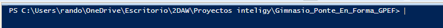

2.  Utilizamos el comando **composer create-project laravel/laravel gpef-gym** para crear el proyecto laravel
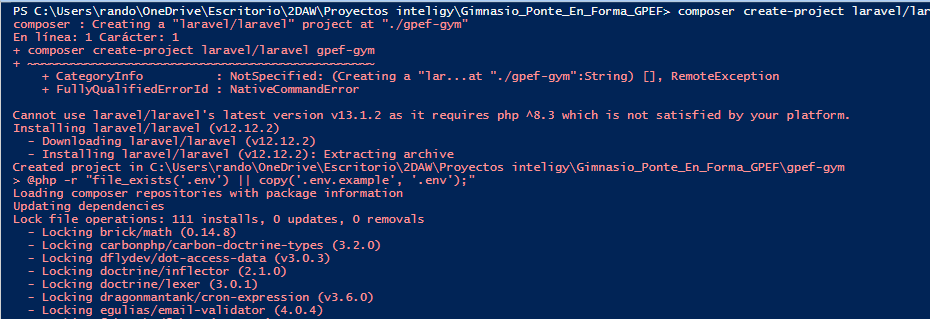

3.  Entramos dentro y arrancamos el servidor.

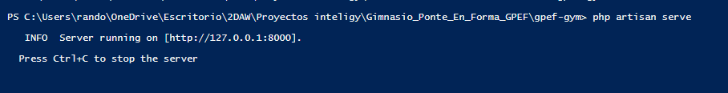
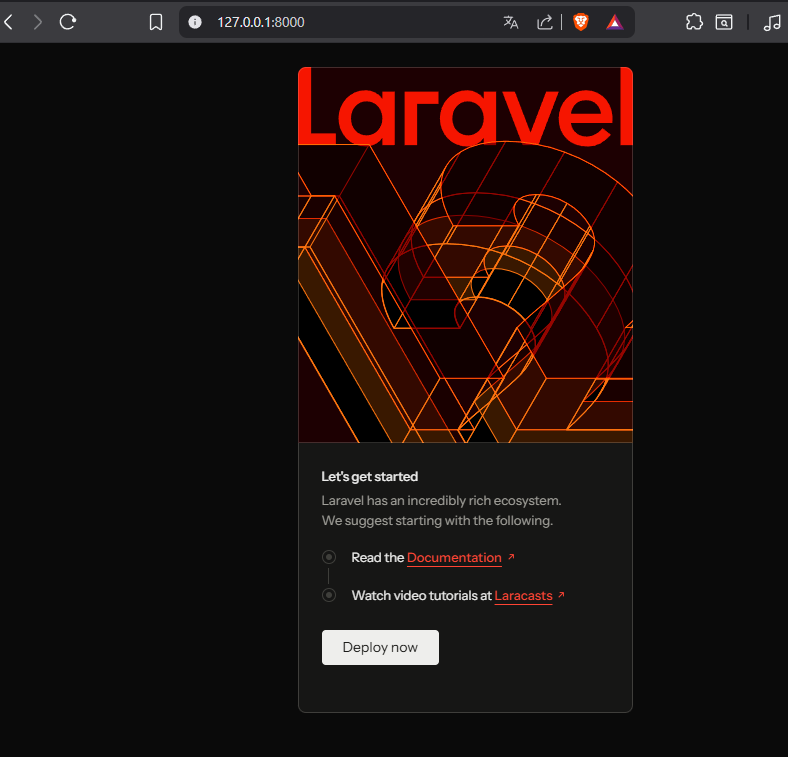

## Configuración del archivo .env

* Buscamos en el proyecto creado el archivo env y lo configuramos para que tenga las credenciales de la base de datos.
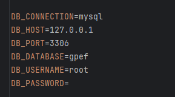

## Creacion de las migraciones con las tablas de la base de datos.
- Para tenter tablas necesitamos una base de datos con el nombre que pusimos en el archivo env, la creamos. 

  - 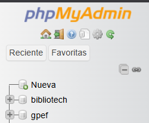

- Ahora en la consola pondremos este comando para ahi crear nuestras tablas Ej. "**php artisan make:migration create_clases_table**" y así con todas las tablas que necesitamos.

  - 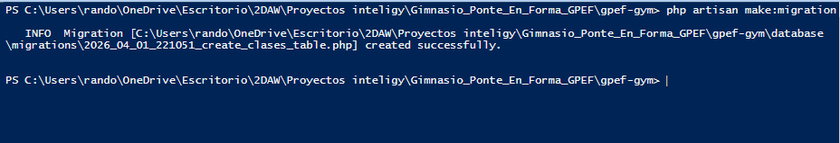
  - 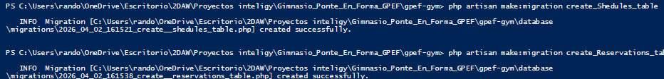

- Y dentro de estos archivos especificamos los campos de la tabla, relaciones y cuando lo tengamos listo utilizamos el siguiente comando **php artisan migrate** para construir las tablas.

    - Nota: En este caso si te equivocas y te sale error debes de refrescar para poder intentarlo de nuevo con **php artisan migrate:fresh**
  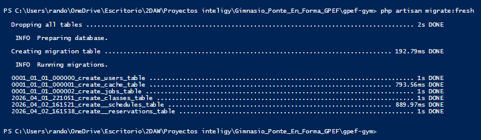

- Ojo comprobamos que todo esté correcto dentro de la base de datos, podemos meternos dentro del diseñador de xampp 
    
    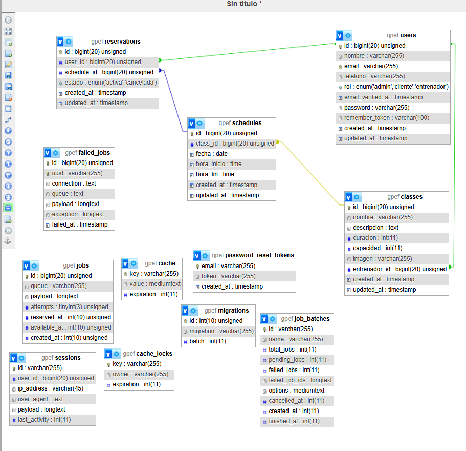

## Modelos

- Los modelos lo que vamos a utilizar para comunicarnos con esas tablas de la base de datos para realizar el CRUD más a delante.
- La ruta donde están es /app/Models hay se crearan nuestros modelos de nuestras tablas con los siguientes comandos:
```
    php artisan make:model GymClass
    php artisan make:model Schedule
    php artisan make:model Reservation
```
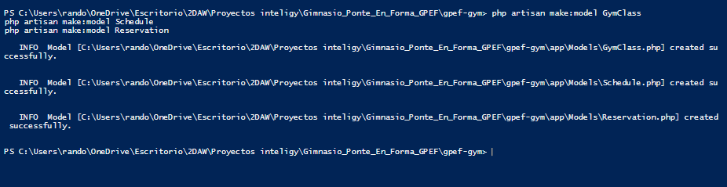
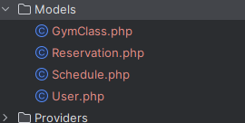
- Nota: Cuidado con la palabra reservada de laravel class por eso se llama GymClass para evitar errores

## Configurar la propiedad de los datos
- Por seguridad, Laravel no deja guardar datos en la base de datos a menos que tú le digas qué campos son "escribibles". Esto se hace con una variable llamada $fillable.

- Así que nos metemos en el archivo /app/Models/GymClass.php /app/Models/Reservation.php /app/Models/Schedule.php /app/Models/User.php
- Para establecer los campos con los que podemos hacer operaciones.

Ej. 
```
<?php

namespace App\Models;

use Illuminate\Database\Eloquent\Model;

class GymClass extends Model
{
    // Le decimos que este modelo maneja la tabla 'classes'
    protected $table = 'classes';

    // Lista de campos que permitimos rellenar
    protected $fillable = [
        'nombre',
        'descripcion',
        'duracion',
        'capacidad',
        'imagen',
        'entrenador_id'
    ];
}

```
- Después establecemos las relaciones para que los modelos se puedan comunicar entre sí.
- Con los siguientes comandos: 

  * hasMany (Tiene muchos)
  * belongsTo (Pertenece a)
  * hasOne (Tiene uno solo)
  Ej.
  ```
      // Una clase pertenece a un entrenador (que es un usuario)
    public function entrenador()
    {
        return $this->belongsTo(User::class, 'entrenador_id');
    }

    // Una clase tiene muchos horarios
    public function schedules()
    {
        return $this->hasMany(Schedule::class, 'class_id');
    }
  ```

## Seeder de roles
- Es para sembrar datos de prueba y no empezar de 0.

- Lo hacemos con este comando en usuarios php artisan make:seeder UserSeeder.

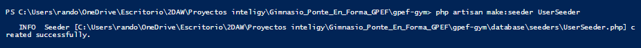

- Creamos también la de class

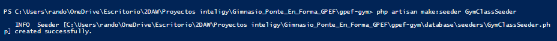

- He utilizado este comando para ejecutar los archivos

php artisan db:seed

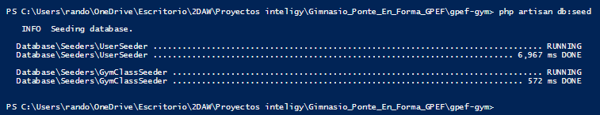

- Y por ahora llegue a la parte del controlador.